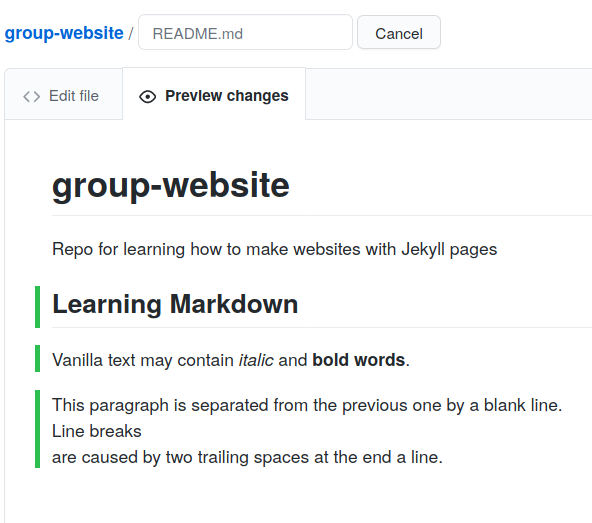

- vanilla text
- adding a title
- bold & italic
- code
  - inline
  - code blocks & formatting
- links
  - inline style
  - reference style
  - reference style makes it easier to re-use and refactor links
- link out to a more comprehensive guide, e.g.
  - https://github.com/adam-p/markdown-here/wiki/Markdown-Cheatsheet
  - https://docs.gitlab.com/ee/user/markdown.html
- save to a file called index.md
- put directory under version control with git
  - link to SWC git-novice

# Markdown
Markdown is a lightweight markup language, i.e. a convention for adding
style information to textual content.
As the name Markdown indicates, the syntax elements of this language
are shut *down* to a minimum.
Having a rather minimalistic syntax, text formatted in Markdown is comparably
readable.
This might be one reason for Markdown having become the language of choice
for formatted user input on websites like, for example:
- [Stack Exchange](https://stackexchange.com/)
- [GitHub](https://github.com/)
- [GitLab](https://about.gitlab.com/).


# Where to Start Writing Markdown?
A lot of tools for rendering Markdown source code exist.
Rendering is the process of generating a nice view of the content
using the style information included in the source text.
Chances are high, your editor can do this.
As we are working towards authoring websites using Jekyll and GitHub pages,
we will use GitHub straight away for learning the basics of Markdown.
The GitHub project you created in the last episode contains a file `README.md`.

The picture below shows the projects default view.
This view includes a rendered view of the content inside the file `README.md`.
Your project should look quite similar except for the red circle around the pencil symbol.


You can click on that pencil symbol to open an editing interface of your projects `README.md` file.
Once you've clicked the pencil symbol, GitHub will open that file in the editing interface.


You can change the content and have a look at the rendered view by clicking the `Preview changes` tab.


Let's add `Some **bold** font` and see what happens when we preview it using the preview tab.
If you like to permanently save the content to the file `README.md`, scroll down a bit and commit your changes.
After having changed something, the commit menu looks like this:


> ## Writing a Commit Message
>
> A commit message is a short, descriptive, and specific comment that will help us remember later on what we did and why.
> You find more about writing commit message in [this section][swc-git-novice-episode-track-changes] of the Git-novice lesson.
>
{: .callout}


# Writing Markdown

Now that we know about the editing interface and preview tab of our projects `README.md`
we can use it as a text editor and investigate selected Markdown features.

Our README.md already contains vanilla text and
two formatting features:
- Heading `# group-website`
- Text markup or emphasis `**bold**`.

Let's do some exercises to learn more about structuring and emphasis.


> ## Add a Sub Heading and Emphasised Text with Line Breaks
>
> Try to reproduce the source code of the following view
>
> 
>
>
> > ## Solution
> >
> >     # group-website
> >     Repo for learning how to make websites with Jekyll pages
> >
> >     ## Learning Markdown
> >
> >     Vanilla text may contain *italic* and **bold words**.
> >
> >     This paragraph is separated from the previous one by a blank line.
> >     Line breaks
> >     are caused by two trailing spaces at the end a line.
> >
> {: .solution }
{: .challenge }

Displaying items in lists, sometimes increases readability.
You can create lists by preceding lines with `-` or a bunch of other `-`-like characters.

> ## List today's learning goals
>
> Give it a try and write a short list of topics you want to learn today.
>
> > ## Solution
> >
> >     - Write Markdown
> >     - Host my first website on GitHub
> >     - Learn about Jekyll
> >     - Think about how my work group could benefit from what I have learned.
> >
> {: .solution }
{: .challenge }

If you would like to nest lists, i.e. specify a sub list as an item of another list, use indentation.
Numbered enumerations are helpful for displaying sequences and the numbers may help to address individual points.

> ## Nested Lists and Enumerations
>
> Try to reproduce the source code of the following view
>
> 
>
> > ## Solution
> >
> >     - A list of items
> >     - can be
> >       - deeply
> >         - nested
> >     - returning to the top-level like this.
> >
> >     2. Enumerations can start at any number and
> >     3. continue to increase
> >     26. in steps of one even of the numering does not. This updates the numbering if individual items are deleted.
> {: .solution }
{: .challenge }

> ## Markdown Cheatsheet
>
> Markdown offers a varyity of formatting features.
> Have a look at this [cheatsheet][github-flavored-markdown] to get an overview or look things up.
>
{: .callout}

You can use single backticks to call out code, e.g. `print('Hello world')` and
use triple backticks to format larger code snippets, creating code blocks.

> ## Add Code
> Fill in the blanks ( __ ) below to create the following view
>
> 
>
>
> > ## Solution
> >
> >     You can reference code `message='Hello World'`
> >     or commands `git status` inside text.
> >     Larger code snippets look like this:
> >     ```
> >     print('Hello World')
> >     ```
> >
> {: .solution }
{: .challenge }

Syntax highlighting of code blocks can increase readability a lot.
You get nice coloured code by adding an language identifier right after the
introductory triple backticks.

> ## Syntax Highlighting
>
> Below are code snippets written in HTML, Python, and R.
> Copy this code
>
> ~~~
> ```_
> print(paste("How","are","you?"), quote = FALSE)
> ```
>
> ```______
> s = "How are you?"
> print s
> ```
>
> ```____
> <!DOCTYPE html>
> <html>
> <body>
> <a href=https://carpentries.org/>This is a link</a>
> </body>
> </html>
> ```
> ~~~
> {: .source }
>
> then guess in which programming language each snippet is written,
> and fill the gaps to activate syntax highlighting, creating this rendered view:
>
> 
>
>
> > ## Solution
> >
> >     ```r
> >     print(paste("How","are","you?"), quote = FALSE)
> >     ```
> >
> >     ```python
> >     s = "How are you?"
> >     print s
> >     ```
> >
> >     ```html
> >     <!DOCTYPE html>
> >     <html>
> >     <body>
> >     <a href=https://carpentries.org/>This is a link</a>
> >     </body>
> >     </html>
> >     ```
> {: .solution }
{: .challenge }


Linking other websites is an essential feature of a website.
Bare URLs like https://carpentries.org/ can be made clickable like this
<https://carpentries.org/> by wrapping them into
angle brackets "\< \>".
However, usually the bare URL is not very nice and displaying a clickable
alternative text is beneficial.

You can define either
1. Inline style links - specifying the URL in line - or
2. Reference style links - referencing a reusable link reference


> ## Links
> Fill in the blanks in this code
>
> ~~~
> Example links:
> 1. [___](https://carpentries.org/)
> 2. [___]___case-InSeNsiTiVe-reference-tag___
>
> [case-insensitive-reference-tag]: https://carpentries.org/
> ~~~
> {: .source }
>
> to create the following rendered view, where both links point to <https://carpentries.org/>:
>
> 
>
>
> > ## Solution
> >
> >     Example links:
> >     1. [Inline link](https://carpentries.org/)
> >     2. [Reference link][case-InSeNsiTiVe-reference-tag]
> >
> >     [case-insensitive-reference-tag]: https://carpentries.org/
> >
> >
> {: .solution }
{: .challenge }


> ## Flavors
>
> Basic Markdown features are the same on all platforms such as GitHub and GitLab.
> However, there are differences in the details and scope of the features offered.
> To address this situation, the Markdown
> used at GitHub is called **GitHub-flavored Markdown**
> and the one used at GitLab is called **GitLab Flavored Markdown**.
> - So be aware of
>   - [GitHub-flavored Markdown][github-flavored-markdown]
>   - [GitLab-flavored Markdown][gitlab-flavored-markdown]
{: .callout}



