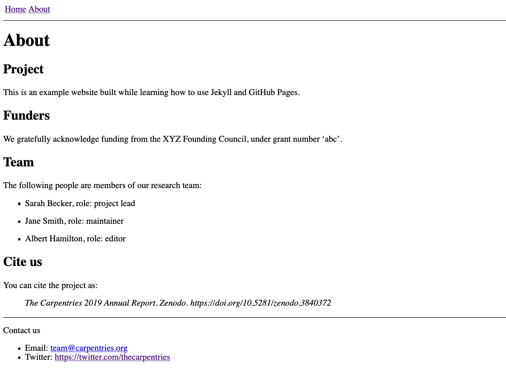
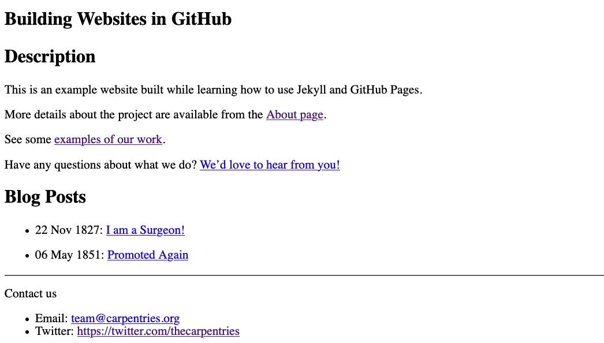



Now we have learned how to substitute and format values stored in variables
into pages on our site, how to include and re-use entire blocks of content,
and how to specify the layout of our different pages.
One thing we are still missing is how to automatically generate
lists of pages and other values:
for a blog site it is usually desirable to include a list of the most
recent posts to the blog, and an archive of all historic posts;
for a group website, we may wish to do something similar with research projects
or profile pages for individual team members.

Using what we already know about Markdown,
we _could_ write these lists by ourselves.
But this would be time-consuming and inefficient:
we would have to manually adjust these listings every time we
write a new post/start a new project/welcome a new team member to the group.
Instead, we will learn about two more features of Jekyll,
_for loops_ and _collections_,
which can be used to populate and update lists within pages automatically.


## List Parameters and For Loops

In addition to the single-value variable types we are already familiar with,
YAML lets us define [lists](https://glosario.carpentries.org/en/#list) and [dictionaries](https://glosario.carpentries.org/en/#dictionary) too.

For example, we may want to list the names of all the team members for a project,
together with their roles and start dates, inside `_config.yml`
and make use of this information throughout the website.

To do so in YAML notation would look like this:

~~~
team_members:
  -
    name: "Sarah Becker"
    role: "project lead"
    start_date: "2016-02-01"
  -
    name: "Jane Smith"
    role: maintainer
    start_date: "2018-03-15"
  -
    name: "Albert Hamilton"
    role: editor
    start_date: "2017-12-01"
~~~
{: .language-yaml}

This defines 'team_members' as a list of 3 elements; each element is a dictionary with key-value pairs for name, role and date.
The syntax for lists in YAML can be a little hard to grasp at first glance.
Each entry in the list is marked by a `-`, indented once to the right.
After this, the contents of the list item is described on lines
indented twice to the right,
with pairs on keys and values.
The keys - `name`, `role`, and `start_date` -
are identical for all entries in the list
but the values differ from one team member to the next.

> ## YAML Syntax Is Flexible
> When browsing documentation and examples of YAML
> you will sometimes see lists represented slightly differently,
> with the first part of the entry value written on the same line
> as the `-`, e.g.
>
> ~~~
> team_members:
>   - name: "Sarah Becker"
>     role: "project lead"
>     start_date: "2016-02-01"
>   - name: "Jane Smith"
>     role: maintainer
>     start_date: "2018-03-15"
>   - name: "Albert Hamilton"
>     role: editor
>     start_date: "2017-12-01"
> ~~~
> {: .language-yaml}
>
> This is also valid syntax and a little more compact,
> but we will place `-` on its own line in this lesson as
> [that syntax is described in the official YAML specification][yaml-lists].
>
{: .callout }

> ## Indentation in YAML
> Note that indentation level in YAML is important -
> it can be a cause of some not-so-obvious mistakes.
> Use online YAML code validators,
> such as [YAML Lint](http://www.yamllint.com/),
> to make sure your YAML is correctly formatted.
>
{: .callout}

Now that the `site.team_members` variable has been defined,
we can insert it into any page on our site exactly as we have done before.
However, with list variables such as this, it is often preferable to _iterate_
through the values so that we can handle and display each one individually.
To do so we need a for loop,
inside which we can define what we want to do to to each of the list's values.
In Liquid syntax, loops are created by surrounding the loop body in `for`/`endfor` tags as:

~~~

[ This is the loop body. Do something with the "thing" variable here. ]

~~~
{: .source }

Let's use a loop to access the information about the team and
display it in `about.md`.

1. Modify `_config.yml` file and add the `team_members` parameter as defined above. The file should now look like:

   ~~~
   description: "This is an example website built while learning how to use Jekyll and GitHub Pages."
   email: "team@carpentries.org"
   twitter: "https://twitter.com/thecarpentries"
   team_members:
     -
       name: "Sarah Becker"
       role: "project lead"
       start_date: "2016-02-01"
     -
       name: "Jane Smith"
       role: maintainer
       start_date: "2018-03-15"
     -
       name: "Albert Hamilton"
       role: editor
       start_date: "2017-12-01"
   ~~~
   {: .language-yaml}

2. In file `about.md`, we add a new section for the team and
   iterate over the values defined in parameter `site.team_members` in a loop to
   display a table of the team members' names and roles.
   The file now should look like:

    ~~~
    ---
    layout: page
    title: About
    ---

    ## Project

    {{ site.description }}

    ## Funders
    We gratefully acknowledge funding from the XYZ Founding Council, under grant number 'abc'.

    ## Team

    The following people are members of our research team:
    
    - {{ team_member.name }}, role: {{ team_member.role }}
    

    ## Cite us

    You can cite the project as:

    >    *The Carpentries 2019 Annual Report. Zenodo. https://doi.org/10.5281/zenodo.3840372*
    
    ~~~
    {: .language-markdown}

{: .image-with-shadow width="800px" }

## Filtering a List

What if we want to pull out the information for a specific team member,
e.g. the Lead of a particular project?
To achieve this,
we can use another filter like the ones we saw in the previous episode:
the `where` filter creates a filtered list containing only those items
that fulfil the criteria provided.
For example, to filter only the project leads from the `team_members` list,
we would write the filter like this:

~~~
{{ site.team_members | where:"role", "project lead" }}
~~~
{: .source }

`where` returns a list,
but we expect there will be only one lead defined for each project,
and in such cases the best way to access this single value from the
filtered list is with another filter, `first`.
This filter returns the first entry in whichever list it is called on:

~~~
{{ site.team_members | where:"role", "project lead" | first }}
~~~
{: .source }

## Assigning Variables Within a Page

We are almost there! But how do we access only the value for `name`  within
the list entry returned by our combination of the `where` and `first` filters?
We cannot do so directly from the filtered list,
but Liquid provides a way for us to create a new variable
from the value returned by those filters.
For this, we use the `assign` tag, e.g.

~~~

{{ lead.name }}
~~~
{: .source }

Use this `assign` tag whenever you need to create variables for use "on the fly"
as you work with lists in your site.
We will see another examples of this when we investigate collections in the
next section.

3. In file `index.md` add the team lead's name so that it looks like:

   ~~~
   # Building Websites in GitHub

   ## Description
   {{ site.description }}
   
   The project is led by {{ lead.name }}.
   [See our full team](about#team)

   Have any questions about what we do? [We'd love to hear from you!](mailto:{{ site.email }})
   ~~~
   {: .language-markdown}

Now, if you need to add, remove or modify a team member,
you only need to update the list in `_config.yml` without modifying your pages.

> ## Exercise: Personnel Changes
> Your project team has changed. The team lead has left and in her place is a new person: 'Tom Cat', who started on
> '2020-10-01'. In addition, the team was expanded and a new developer called 'Alice Dauncey' joined on '2020-09-15'.
> Update your website to reflect these team changes.
> > ## Solution
> > Luckily, we keep all our global settings in `_config.yml` so all we have to do is update the values there. This saved us some work as for the team lead we would otherwise have to modify both `index.md` and `about.md`.
> >
> > For the new developer joining the team, we also only need to her information to `team_members` in `_config.yml` and our `for loop` from `about.md` will simply pick up the changes automatically. Magic! Our `_config.yml` file should now look like:
> >
> > ~~~
> > description: "This is an example website built while learning how to use Jekyll and GitHub Pages."
> > email: "team@carpentries.org"
> > twitter: "https://twitter.com/thecarpentries"
> > team_members:
> >   -
> >     name: "Tom Cat"
> >     role: "project lead"
> >     start_date: "2020-10-01"
> >   -
> >     name: "Jane Smith"
> >     role: maintainer
> >     start_date: "2018-03-15"
> >   -
> >     name: "Albert Hamilton"
> >     role: editor
> >     start_date: "2017-12-01"
> >   -
> >     name: "Alice Dauncey"
> >     role: "developer"
> >     start_date: "2020-09-15"
> > ~~~
> > {: .language-yaml}
> > Check the changes in your website.
> {: .solution}
{: .challenge}

## Introducing Collections

To finish things off, we will combine what we have learned here about
lists and loops,
with page layouts,
filters,
and the global configuration of our site,
to create a blog feed that automatically updates whenever we create a new post.

In [the _Working with Filters_ episode]({{ relative_root_path }}/filters/) we
created a few blog posts, and would now like to display a list of these
posts on a new page of the site.
For this to work, we must tell Jekyll that the source files for these posts
are related to each other i.e. that they all belong within a category,
blog posts,
that the other pages we have made so far do not.
The mechanism Jekyll provides to do this is called a _collection_:
a defined set of files that should be accessible as a set.
Once we have defined this collection of blog posts,
it will be accessible to us as a list variable,
which we can then loop through and present in a variety of different ways on our site.

## Configuring a Collection

Defining a collection requires us to do two things.
First, we must tell Jekyll about the collection by adding a new block
to the global configuration of the site.
In `_config.yml`, we add the following lines:

~~~
collections:
  -
    blogposts:
      -
        output: true
~~~
{: .language-yaml }

The `collections` field is a list of lists!
This list contains only one entry, which is also a list that contains only one entry.
It is reasonable to find this confusing.
You might find that it makes (a little) more sense
if you consider that we may wish to define multiple collections for our site
and configure them each differently.

The entry in the `collections` list, `blogposts`,
says that our site includes this collection of files,
and the entry in that `blogposts` list, `output: true`,
is a configures an option for that collection.
It tells Jekyll to create a rendered HTML page from the content
of each of these files.

Now that we have configured our site to build this collection,
we need to populate it.
Jekyll will look for a folder in our site repository that shares its name with
the collection we defined, but with a preceding underscore in the folder name,
and build the collection from its contents.
In this case, we need to move all our blog post files into a `_blogposts` folder.

Once we have done that,
we can check that the collection has been created correctly by
trying to use it in a page.

> ## Why `output: true`?
>
> When creating our `blogposts` collection in `_config.yml` above,
> we configured it with the parameter `output: true`,
> to ensure the pages of the collection were rendered to HTML by Jekyll.
>
> The other use of collections is as a collection of "data" files,
> defining objects that can be used as a list of variables throughout the site.
> For example, to avoid swelling the `_config.yml` file every time
> our team welcomes a new member,
> we could have created an individual file for
> each of the members of our team, defined a collection, and looped through
> those members that way.
> To use the collection of files like this,
> we would keep the default value of `output`, `false`.
{: .callout }

## Looping Over a Collection

At the end of your `index.md`,
add a new for loop to iterate over the titles and dates of the `blogposts` collection:

~~~
## Blog Posts


- {{ post.date | date_to_string }}: [{{ post.title }}]({{ post.url | relative_url }})

~~~
{: .language-markdown }

{: .image-with-shadow width="800px" }

There is a lot happening in those few lines above!
Let's break it down into smaller chunks and explore them one-by-one:

1. ``
   initialises a loop through the collection.
   The collection itself is made available to us as a `site` variable,
   with the name we gave it in `_config.yml`.
2. `- ` will create a bullet point for each post.
3. `{{ post.date | date_to_string }}` accesses the `date`
   defined in the post's YAML header and displays it in the list as a string.
4. `[{{ post.title }}]({{ post.url | relative_url }})` creates a link with the post's title
   (again extracted from the YAML header of the post file) as the link text,
   and the URL of the rendered post page as the link target.
   Unlike the page title,
   the URL is not defined in the page front matter but instead provided by Jekyll.
   This page URL is passed to the `relative_url` filter,
   which ensures the base URL of the GitHub Pages site is prepended and
   the link resolves correctly.
5. `` ends the for loop after every post in the
   collection (i.e. every file in the `_blogposts` folder) has been iterated over.

Clicking on one of these links takes us to the rendered version of the blog post page.

What's even better is that
Jekyll has taken care of ordering the posts according to their publication date:
this is a special handling of the `date` parameter -
if it is present in the YAML header of pages in a collection it will automatically
be used to define the order in which the collection is delivered in the site.
If you would like to order a collection by a different field in the YAML header,
you can pass the collection through the [`sort`][liquid-sort] filter
when initialising the for loop:

You might be tempted to write:
~~~

~~~
{: .warning }

which seems to work but may not produce the result we expect.

In fact, Jekyll will generate a **silent warning** that isn't visible in GitHub
but can be seen if building the site locally.
This a limitation of liquid in that it doesn't allow combining `for` instructions directly
with filters.
Instead, we need to reuse the `assign` instruction we used above:
~~~


~~~
{: .source }

Other filters also exist for working with lists of values,
such as [`group_by`][liquid-group-by],
which can be used to group the values by a particular field,
and [`sample`][liquid-sample],
which returns a random sample of the values in the list.

> ## Exercise: Adding the Post Author
>
> Extend the example above to also state the name of the author
> next to each post in the list.
>
> > ## Solution
> >
> > ~~~
> > 
> > - {{ post.date | date_to_string }}: [{{ post.title }}]({{ post.url }}) by {{ post.author }}
> > 
> > ~~~
> > {: .source }
> {: .solution }
{: .challenge }

> ## Exercise: Reusable Post List
>
> A list of blog posts is exactly the kind of component we are likely to want to
> use in multiple places throughout the site.
> Move the code to create the listing to a new file in the `_includes` folder,
> modify it to work as an included block,
> and `include` it again the end of `index.md`.
>
> > ## Solution
> >
> > Create a new file, `_includes/post_list.html`, with the following content:
> >
> > ~~~
> > <h2>Blog Posts</h2>
> > <ul>
> > 
> > <li>{{ post.date | date_to_string }}: <a href="{{ post.url | relative_url }}">{{ post.title }}</a></li>
> > 
> > </ul>
> > ~~~
> > {: .language-html}
> >
> > and add an `include` statement at the end of `index.md`:
> >
> > ~~~
> > 
> > ~~~
> > {: .source }
> {: .solution }
{: .challenge }

> ## Exercise: Extend the Collection
>
> Create another blog post and add it to the `blogposts` collection.
> Check that your new post appears in the list.
>
> > ## Solution
> >
> > Write another post Markdown file and save it into the `_blogposts` folder,
> > making sure you remember to add (at least) the `date` and
> > `title` fields in the YAML header.
> >
> > A link to the rendered version of that file should automatically appear
> > in the blog post list of your site's landing page (`index.html`).
> >
> {: .solution }
{: .challenge }

## Blogging in the Wild: the `_posts` Collection

We named our collection `blogposts` above but it is much more common to find
Jekyll sites using a collection called `posts`
(and associated `_posts` folder for blog post files).
The `posts` collection has a special meaning to Jekyll:
the platform is so often used for blogging that it has some
"magic" built in to work with the files in `_posts`.

One of the key differences is the way that URLs are created for pages built from
the `posts` collection:
the `YYYY-MM-DD` date string defining the date of the post is used
to create a nested URL structure of `/YYYY/MM/DD/`.
For this reason, _Jekyll requires that files in the `posts` collection
follow the naming structure `YYYY-MM-DD-post-slug.md` in order to be built for
the site.
For example, a file in `posts` called `2019-09-04-rise-and-shine.md`
will be published at the URL `<site-url>/2019/09/04/rise-and-shine.html`.

Jekyll also provides some other special features for working with a collection
called `posts`, such as tags and categories to help organise the pages of your
site.
You can read more about the
[features of the `posts` collection in the associated page of the Jekyll documentation](https://jekyllrb.com/docs/posts/).

Finally, it is common to need to create a listing of posts
(or some other collection)
that is displayed in smaller chunks e.g. ten posts at a time.
This is called _pagination_,
and is enabled in Jekyll via a plugin called `jekyll-paginate`.
(This plugin is included by default in GitHub Pages.)
The Jekyll documentation describes
[the steps for setting up pagination for a list of blog posts](https://jekyllrb.com/docs/pagination/).

## Linking to Other Pages on Your Site

Creating internal links that are robust to changes in your site
base URL, and that work both online and in locally-built preview versions
of your site, requires a bit of extra work.

You can access the URL of a built page via the `page.url` variable
(as we did when listing the entries in our `blogposts` collection above)
or, if referring to that page from the body of another page,
with the `` tag.
The path provided here should be relative to the root of your site -
the directory where your `config.yml` is located.
Taking the example from the `posts` collection above:

```

```
{: .source }

```
/2019/09/04/rise-and-shine.html
```
{: .output }

If you would like to
[set up your computer to build your site locally][jekyll-install]
e.g. to preview changes to your site before they "go live" on GitHub Pages,
you should get into the habit of substituting in the `site.baseurl` variable
at the start of these internal links:

```
{{ site.baseurl }}
```
{: .source}

This will ensure that the links within your site work correctly in the local
version of the site as well as on GitHub Pages.

> ## Comments on a Static Blog
>
> When setting up a blog on a website, it is common to want to include a comment feed
> as a way for readers to respond to the content of a post, direct questions to the author, etc.
> A comments section can be included in a static blog using one of the below approaches.
> 1. Disqus is the first approach. The Disqus website offers
>    [instructions on how to enable comments for Jekyll platform (used for GitHub pages)](https://disqus.com/admin/install/platforms/jekyll/).
>    [Here is a demo of Disqus with Jekyll](https://erresen.github.io/jekyll/disqus/2016/08/26/getting-comments-working-jekyll-disqus.html).
>    Although if you are privacy inclined, browser extensions such as Privacy Badger block the Disqus widget so you might look for alternatives.
> 2. [Staticman](https://staticman.net/) is the second approach.
>    The setup is more complex than some of the other options and, in our experience, it is easy to get the configuration wrong.
>    [Here is a demo of comments with Staticman](https://travisdowns.github.io/blog/2020/02/05/now-with-comments.html).
> 3. [Just Comments](https://just-comments.com/) is the third approach.
>    [Here is a demo of comments with Just Comments](https://60devs.com/adding-comments-to-your-jekyll-blog.html).
> 4. [fastpages](https://github.com/fastai/fastpages) is the most recent addition to
>    enable comments via GitHub comments (uses [Utterances](https://utteranc.es/)).
>    fastpages comes with lots of options and is used by several researchers.
>    [Here is a demo of comments with fastpages](https://fastpages.fast.ai/fastpages/jupyter/2020/02/21/introducing-fastpages.html).
> 5. [Welcomments](https://welcomments.io/) (currently in beta testing) provides a webform for comments,
>    and a bot that commits these to your website's source GitHub repository so that they are included
>    and displayed when the page is rebuilt.
> From the comments section implementation standpoint, Disqus looks most simple followed by Just Comments and Staticman.
> Fastpages is much more than enabling a comments section.
> It is a blog template that uses Jekyll as a base, improves on Jekyll experience and offers additional features.
> For researchers this may be the option to go.
>
> {: .source}
{: .callout}


