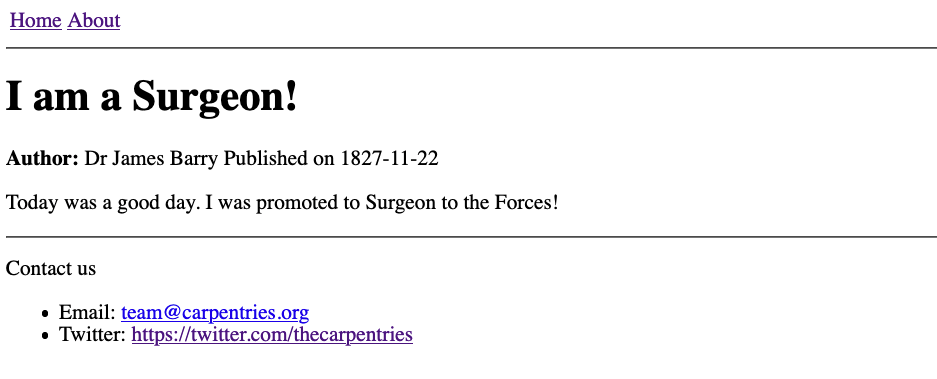
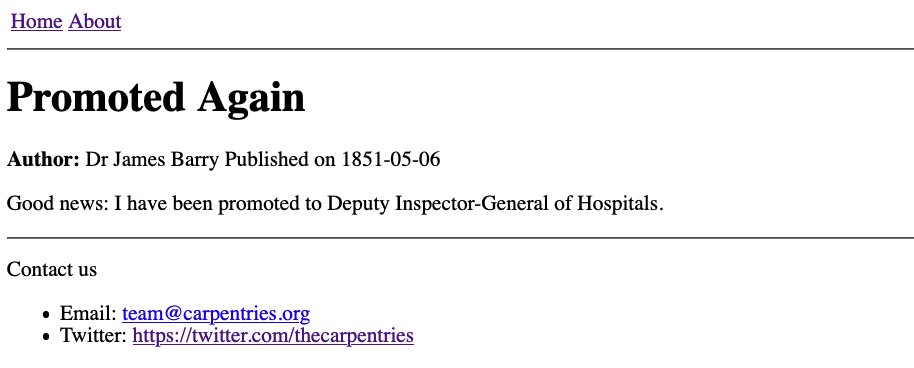
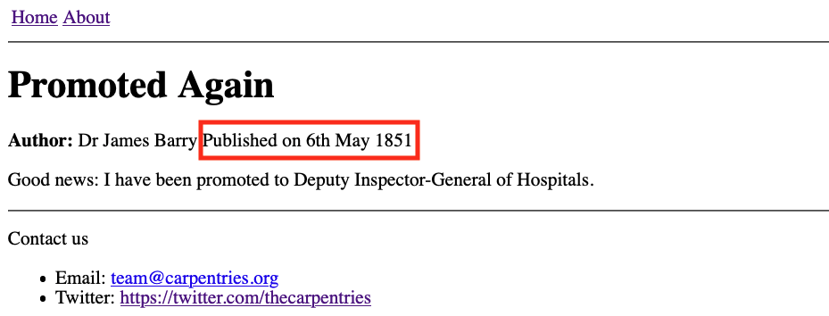
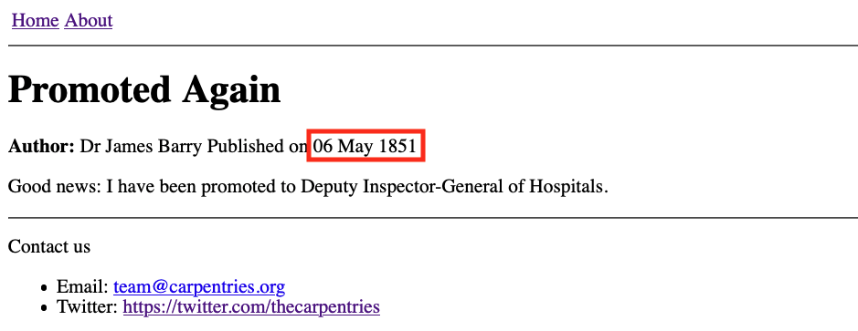

## Writing Blog Posts

So far we have been building our site one page at a time,
but these individual pages are quite self-contained and their content
is likely to be fairly constant:
the information on our home page, our contact details etc
are unlikely to change very often and,
after the site has been built,
new pages like this probably won't be created often.
This is good because,
if we would like to construct a list or a navigational menu
to browse through these pages,
it would be annoying to have to expand/reorganise this all the time
when a new page is added to the site.
(We will actually build an automatically-updating list of pages like this in the final section.)

However, it is common for sites to also host a series of shorter pages
as blog posts
(usually with a page listing the posts - again,
there will be more on this in the final section),
which are typically structured differently or contain different information
to the standard pages (such as publication date, author name, etc).

To start adding blog posts to our site
the first thing we need to do is create a new layout for these posts,
inheriting from the default layout we created earlier.

~~~
---
layout: default
---

<strong>Author:</strong> {{ page.author }}
Published on {{ page.date }}

{{ content }}
~~~
{: .language-html }

Save this layout to `_layouts/post.html`.
Now we can create our first blog post (**in the root of our website repository for now**), `1827-11-22-surgeon.md`,
remembering to add the `author` and `date` fields
to the YAML front matter:

~~~
---
layout: post
title: I am a Surgeon!
author: Dr James Barry
date: 1827-11-22
---

Today was a good day. I was promoted to Surgeon to the Forces!
~~~
{: .language-markdown }

You can view the post at `https://GITHUB_USERNAME.github.io/REPOSITORY_NAME/1827-11-22-surgeon.html`.

{: .image-with-shadow width="700px" }

This is a good start! Let's make a second post before we try to further improve
our post layout.

> ## Exercise: Creating Another Post
>
> Write another blog post, in a file called `1851-05-06-DIG.md` in the root of our website repository,
> so that the rendered page looks like this:
>
> {: .image-with-shadow width="700px" }
>
> > ## Solution
> > Create the file `1851-05-06-DIG.md` in the root of the repository with the following content:
> > ~~~
> > ---
> > layout: post
> > title: Promoted Again
> > author: Dr James Barry
> > date: 1851-05-06
> > ---
> >
> > Good news: I have been promoted to Deputy Inspector-General of Hospitals.
> > ~~~
> > {: .language-markdown }
> > You can view the post at https://GITHUB_USERNAME.github.io/REPOSITORY_NAME/1851-05-06-DIG.html.
> {: .solution }
{: .challenge }

## Introducing Filters

The YYYY-MM-DD format for dates is easy to remember and
[great for computers][date-iso]
but could be formatted a little more nicely for a human reader.

To ensure consistency throughout all our posts in the future,
we can define the format in which the date should be displayed in the `post.html`
layout file.
The YYYY-MM-DD date in the post front matter will be converted to
a more human format (e.g. "6th May 1851" instead of "1851-05-06" in the second post `1851-05-06-DIG.md` we added) at the top of each post,
using a _Filter_:

~~~
Published on {{ page.date | date_to_long_string: "ordinal" }}
~~~
{: .language-markdown }

{: .image-with-shadow width="700px" }

Filters like `date_to_long_string` can be used when
working with variable values on a page.
When a filter is applied to a variable, it processes that value in some way:
in the example above, it converts the format of the date string.
We will explore the `"ordinal"` part in the exercise below.

> ## Exercise: Date Formats
>
> `"ordinal"` is being passed as an argument to the `date_to_long_string` filter.
> To see how this argument is changing the behaviour of the filter,
> try removing it in the second post (`1851-05-06-DIG.md`), i.e.
> `{{ page.date | date_to_long_string }}`.
> What happens?
> Which output do you prefer?
>
> > ## Solution
> >
> > Without the `ordinal` argument, `date_to_long_string` produces the output
> > `06 May 1851` (i.e. using the two digits to represent day).
> > Whether you prefer this format is entirely subjective,
> > and we encourage you to use which ever you prefer in your post layout.
> > {: .image-with-shadow width="700px" }
> >
> {: .solution }
{: .challenge }

These filters are based on Liquid,
the scripting language underlying Jekyll.
We will see another example of a filter in use in the next, final section,
after learning a bit about arrays and collections in Jekyll.

> ## Documentation and a Word of Warning
> [A complete list of available filters][filters]
> is provided in the [official Jekyll documentation][jekyll]
> and you might also find it helpful to refer to
> [the official Liquid documentation][liquid]
> while you continue to explore.
>
> Beware however, that
> **GitHub Pages does not use the most up-to-date version of Jekyll!**
> This means that some features you will read about in the Jekyll documentation
> will not be available for you to use on your site.
> [Use this page to check the versions of Jekyll and other dependencies used by GitHub Pages][ghp-dependencies].
{: .callout }


