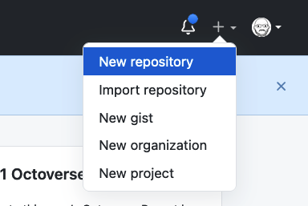
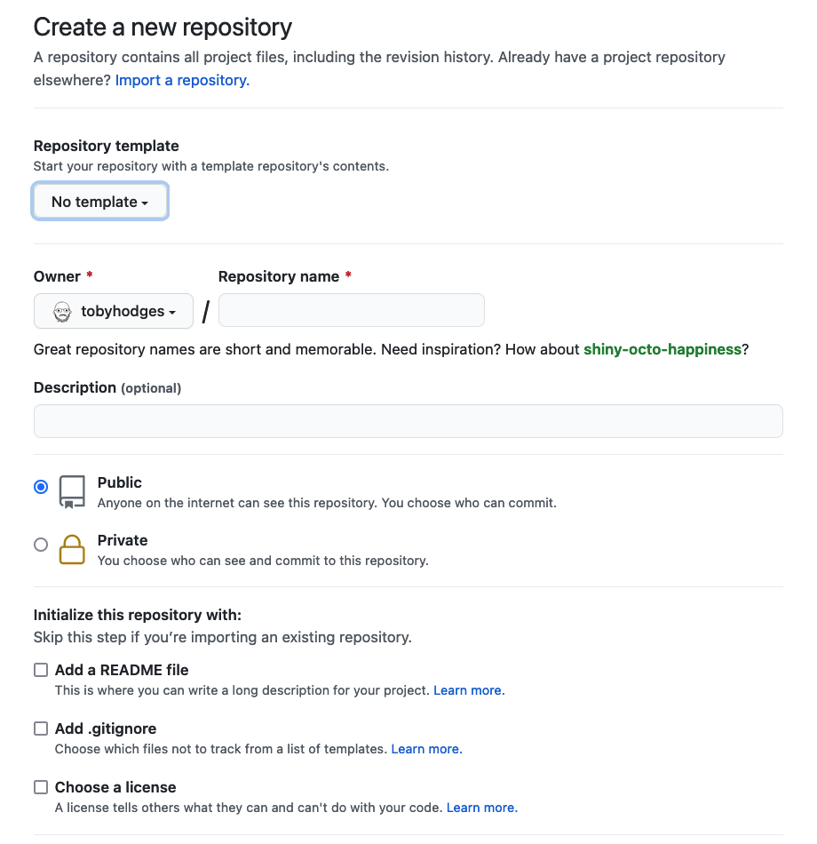
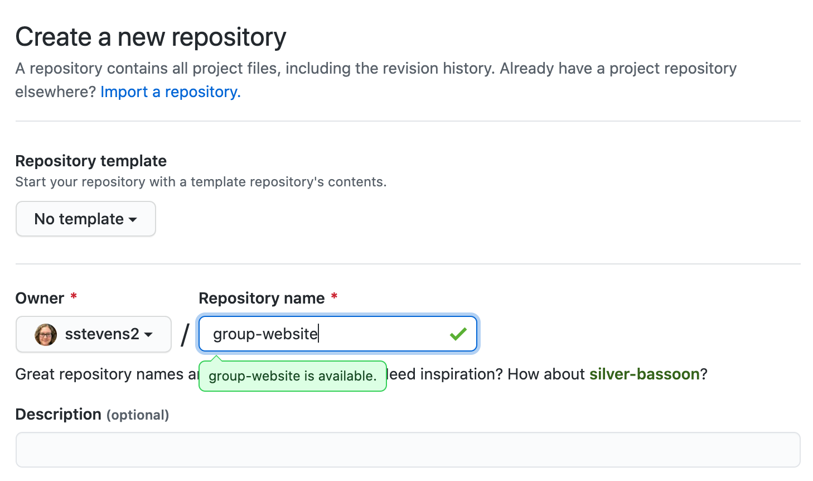
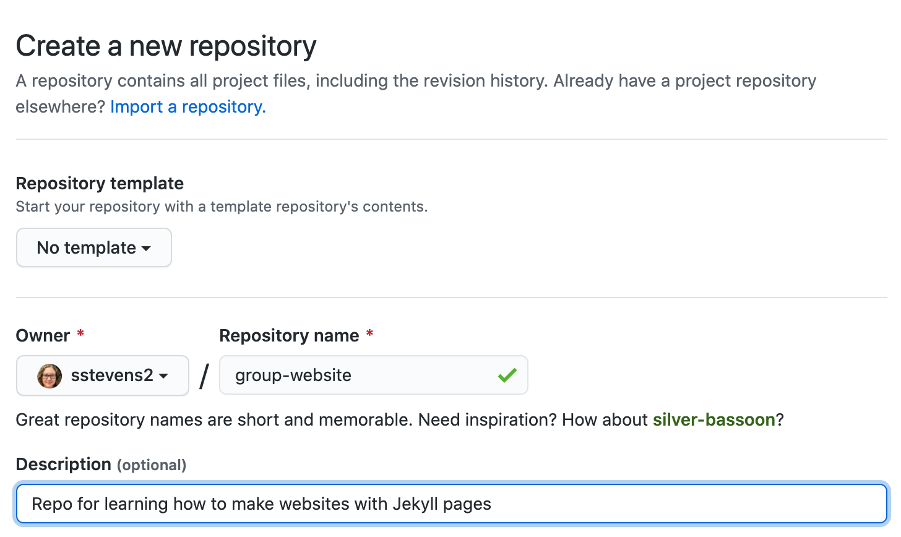
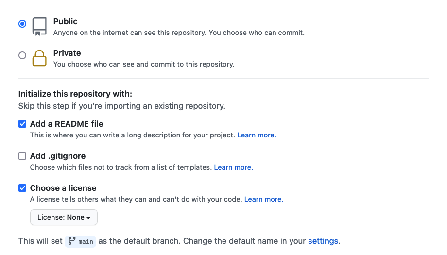
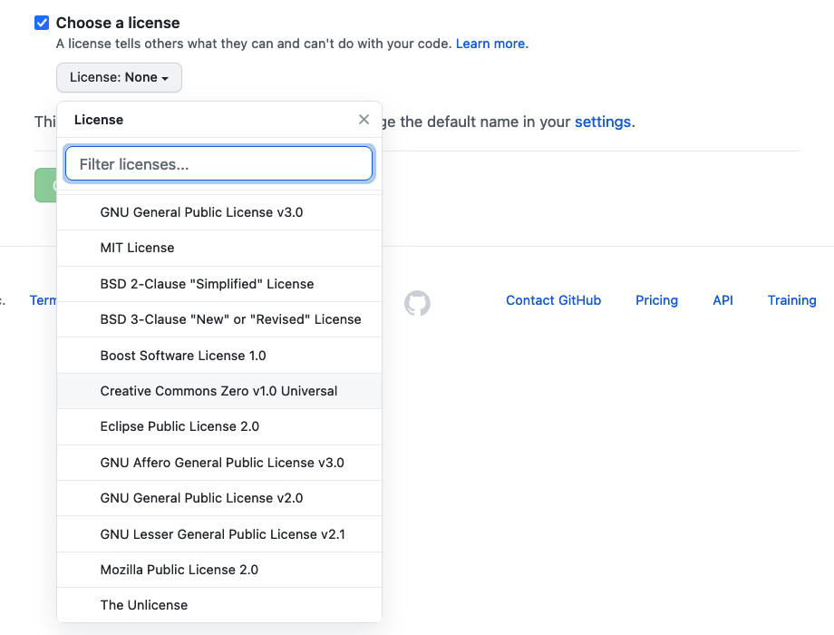
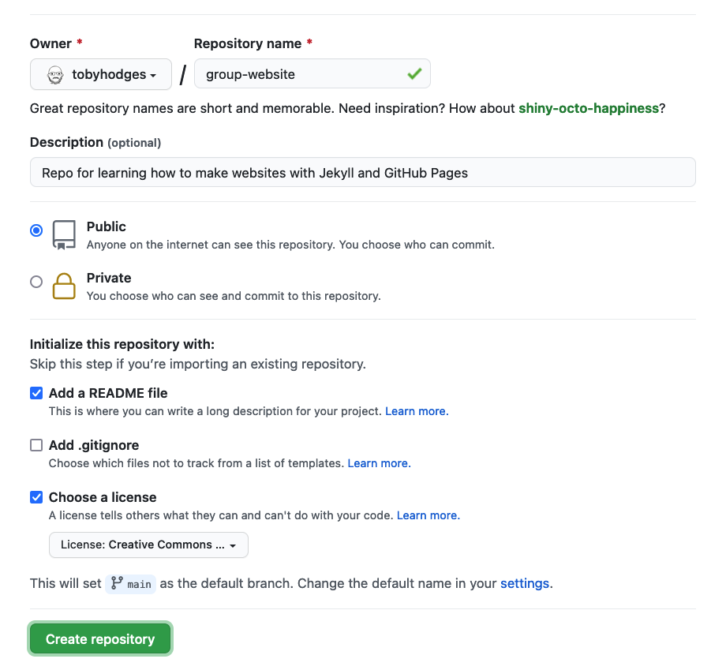
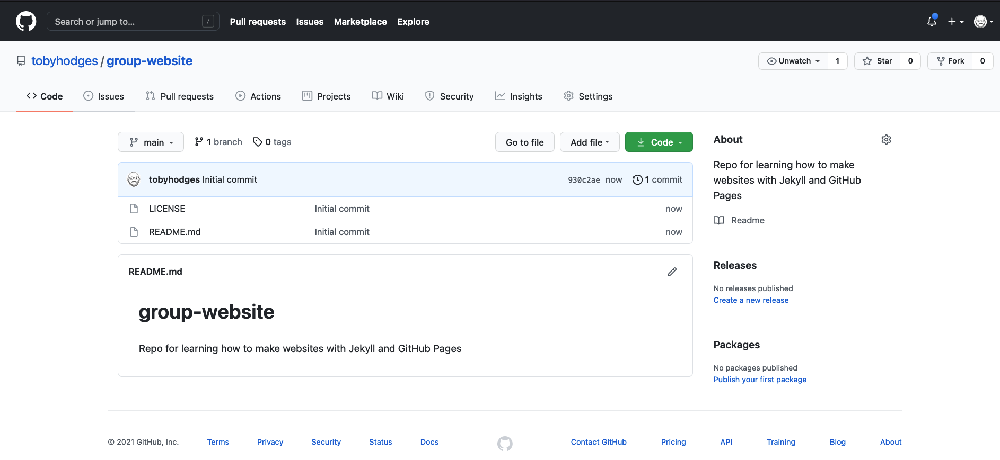

## How Websites Work

When we use a web browser to visit a page on the World-Wide Web,
the browser asks for information from a server -
a computer storing the data relevant to the site and configured to receive and respond to requests for that data.
Assuming there were no problems at this stage
(e.g. asking for a page which doesn't exist, or being unable to reach the server),
our browser receives and interprets this information
to render and display the webpage on our screen.
(A web developer would probably be horrified to read such a gross oversimplification,
which is just one reason why
web developers are not the target audience of this tutorial.)

The page displayed by the web browser is the result of combining
**HTML** - a hierarchical format describing the structural elements of the page and their raw content - with
**CSS** - an ordered set of styling instructions telling the browser how the content should be organised and formatted -
and any **images** that should be embedded in the page.
Other information received from the server,
but not displayed by the browser,
includes **metadata**, **cookies**, and other non-visible elements in the HTML -
information about the site that could be relevant for a computer
but probably isn't interesting to a human
(there are [exceptions][qwantz-easter-egg-ext] to this) -
and scripts that the browser may run to do something
in response to various triggers.

## Hello world in HTML

When learning a new programming language,
you may often find a reference to the popular `Hello world`.
These examples typically capture the simplest code that
can produce and display the `Hello world` on screen.

As HTML requires certain tags to be present and almost always in matching pairs (open `<tag>` and closing `</tag>`),
HTML documents tend to get verbose rather quickly.

The simplest, valid HTML `Hello world` is:

~~~
<!DOCTYPE html>
<html>
  <head>
    <title>Page title</title>
  </head>
  <body>
    
Hello World

  </body>
</html>
~~~
{: .language-html }

So as you can imagine, writing long HTML documents by hand is rather painful.
Notice that we didn't specify anything about how and where the text should be displayed.

To achieve this we would additionally need to include stylized tags or Cascading Style Sheets (CSS) instructions.
If you do not provide CSS instructions (either inside your HTML document or as a separate file),
a web browser will make a best guess regarding the layout of HTML elements on the page based on its defaults.

> ## The many tags in HTML
>
> In the `Hello world` example above 5 different tags are used (`html`, `head`, `title`, `body` and `p`) in their open `<>` and closed `</>` form.
> We see also the special `doctype` tag that indicates the format and version of the document, in this case, [HTML(5)][html5-wikipedia].
>
> Other examples include frequently used tags for structural elements such as `div`, `span`, `nav`, `section`;
> stylized tags `i`/`em`, `b`/`strong` and `u` for *italics/emphasis*, **bold** and <u>underlined text</u>;
> headings numbered from `h1` to `h6` for titles and progressively smaller sub-titles;
> `img`, `video`, `audio` to embed rich media;
> and the important `a` tag (anchor) used to [link](#) to sections in the same or other documents.
>
> The [list of valid HTML tags][html5-tags] is rather extensive,
> covering a rich range of features powering today's [world wide web][www-wikipedia].
{: .callout }

> ## Exercise: Writing Basic HTML
>
> Given the stylized text:
>
> <h1><em>Hello</em> World</h1>
>
> write the HTML that will produce the same result.
> **Hint** the big font is achieved by use of a heading.
>
> > ## Solution
> >
> > ~~~
> > <h1><em>Hello</em> World</h1>
> > ~~~
> > {: .language-html }
> {: .solution }
{: .challenge }

## Static vs Dynamic Sites

Sites consisting of pages whose content doesn't change
after that initial information is received by the server
are referred to as _static_ (for example, a website containing one's CV).
Conversely, sites whose pages can be updated after loading,
with information continuing to be passed between browser and server,
are called _dynamic_ (for example, pages showing current date and time or shopping baskets, Twitter or Facebook pages,
which might be updated between each two page refreshes).
This lesson focuses on static sites and tools that can be used to create them,
known as **Static Site Generators**.

One of the advantages of using static site generators is that
they remove the need for us to manually produce a lot of HTML,
allowing us to focus on the human-readable content we want our pages to contain.
However, we still need a way to tell the generator how we want our content
to look when it's displayed in the browser.
For that, we will use a tool called Markdown, which we'll learn about in the next episode.

_Figure 1.1: Page Generation Alternatives. This figure was originally published in [JavaScript for Data Science][js4ds], and is reproduced here with permission from the original author._

Static-generated sites are a great choice when the information you want to
display on a website is the same regardless of who visits your site
and when,
and if the content of your pages is unlikely to need to change very often.
This makes Static Site Generators a good choice for sites that provide
documentation or lesson content like this page:
the aim of the page is to deliver the same information to every visitor.
The visitor can arrive,
(hopefully) find and read what they need,
and leave feeling happy and fulfilled.

Dynamic sites provide a lot more possibilities for providing interactivity and
personalised or topical content.
But creating them is a degree more complicated
and also places considerable additional burden on the server,
not least in terms of computational requirements and security considerations.
Among other things this means that,
unlike with static pages (see the rest of this lesson),
you're unlikely to find cost-free platforms to help you deliver dynamic content.

> ## Exercise: The Perfect Tool for the Job
>
> Given the following types of websites,
> reason if a static site generator is an appropriate solution to implement them.
>
> - (1) A personal website with *About* and *Projects* sections
> - (2) A forum or discussion platform
> - (3) A community blog or news website
> - (4) A search engine (such as google.com)
> - (5) A wiki (such as wikipedia.com)
> - (6) An online book
>
> > ## Solution
> >
> > - (1) **personal website**: In most cases, **Yes**. This kind of content is typically written/edited by one person and meant to have a read-only access to visitors.
> > - (2) **forum or discussion**: Most likely **No**. Such website requires interactivity and ways to identify who wrote what content.
> >
> > For questions 3 and 5 the answer is both **Yes** and **No** depending on the requirements and necessary functionality.
> >
> > - (3) **blog/news**: A simple blog or news website, maintained by a small set of users, is perfectly achievable by using a static generator. For very large groups of content creators or if access to articles needs to be controlled individually, using a static generator will lead to difficult technical challenges.
> > - (4) **search engine**: Most often **No**. Implementing something as sophisticated as Google's search would be close to impossible with a static generator. There are ways to have a simple engine that searches across all pages produced by a static generator using indexing and making clever use of browser features but this approach has many limitations.
> > - (5) **wiki**: A simple wiki is perfectly doable with a static generator (e.g. [GitHub Wiki Pages](https://guides.github.com/features/wikis/)), however it becomes limiting as soon as its content needs to be edited or discussed by many users, as is the case of Wikipedia.
> > - (6) **online book**: Definitely **Yes**. Static generators are perfect for this type of website. They typically provide ways to avoid repeating content (variables and templates), automatic creation of a *Table Of Contents*, among other goodies.
> {: .solution }
{: .challenge }

## GitHub Pages

If the site you want to create is a good match to the strengths of a static site generator -
it's relatively small, will be updated relatively infrequently, and the content does not need to be personalised to the visitor -
then creating it with GitHub Pages is a good option.
GitHub Pages is a system allowing users to create and serve websites directly from their GitHub repositories.
The service is free for public repositories and simple pages can be created and served with very little configuration required.

Behind the scenes GitHub Pages uses a static site generator called Jekyll, which we're going to learn about later in this lesson.
First, we need to learn more about how to author and format the content of our pages,
before configuring GitHub to display this content as a website.

## Setting Up a Repository

Before we get into working with Markdown we must first create a
repository to work in.
This repo (short for repository) is similar to a folder on your computer, the main differences
being that the folder lives on the web in GitHub/GitLab (though you can
also keep a copy on your computer if needed) and that folder is using
a version control software called [`git`][git] to track changes to the files.
For our purposes we will mostly be ignoring the version control software,
though it can be handy if you need to revert to old versions
(see [Software Carpentry - Version Control with Git][swc-git] for an introduction).
In this lesson we will be working with this folder on the web to control
the website we will be creating.

> ## Setup a GitHub account
> Before you can create a repo, you will need to
> [create a GitHub account](https://github.com/join)
{: .callout}

Make sure to login with your GitHub account and visit https://github.com.
Click the green "New" repo button on the left hand side of GitHub:

**or** click the "+" menu in the upper righthand corner and
choose "New Repository".

Next you will need to fill in some info about your repository.

In this lesson, we will be working on a general group website.
You can imagine this website may be for your lab group, a specific project group,
or another group you work with.
Under the "Repository name" field type `group-website`.

We can also add a description (for instance **Repo for learning how to make websites with jekyll pages**) so we know what this repo is when we find it again after the workshop.

Under the "Initialize this repository with:" section we will check `Add a README file`
and `Choose a license`.  It is good practice to have a README file that gives more information
about your repo and to set a license for your work.

for this example repository we’ll use the `Creative Commons Zero v1.0 Universal` (CC0) license,
which allows anyone to re-use and adapt the content of the repository without restriction,
but you may want to consider choosing something more restrictive when you’re building
your own website.

> ## Checkout other licenses
> You may want to checkout [this lesson](https://swcarpentry.github.io/git-novice/11-licensing/index.html) or
> [GitHub's license documentation](https://docs.github.com/en/free-pro-team@latest/github/creating-cloning-and-archiving-repositories/licensing-a-repository)
> for more information about possible licenses.
{: .callout}

Once you've finished these steps you can click the "Create Repository" button to
finish creating the repo.

GitHub will then setup the repo and it should look like the following screenshot.

[qwantz-easter-egg-ext]: https://chrome.google.com/webstore/detail/dinosaur-comics-easter-eg/bojkkeeefjmeogpgnlomodfkkfkfhabj


