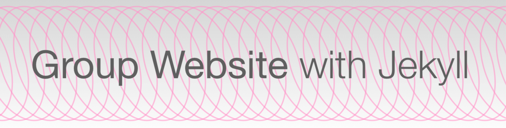
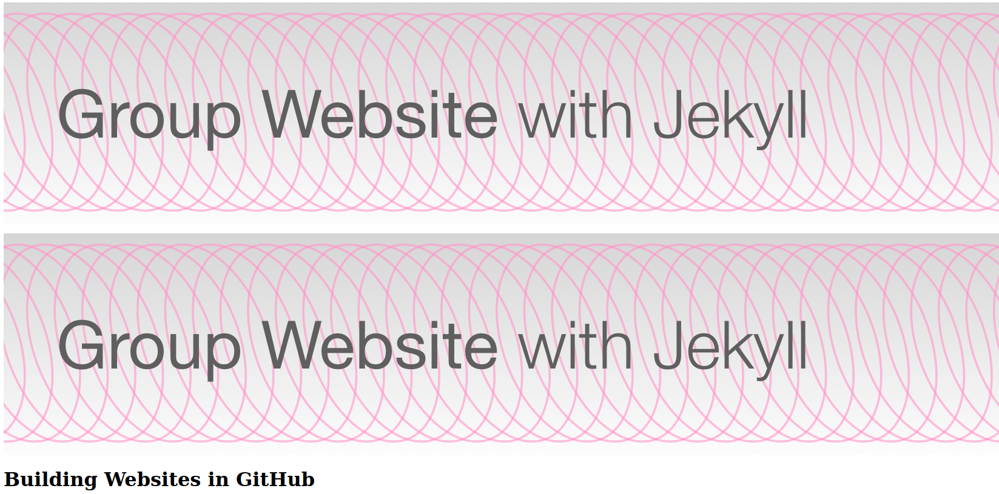

Elements that will appear on every page across our website,
like the banner image we `include`d in our pages in the previous section,
form part of the structure of the page:
unlike the content specific to each page,
these structural elements do not change from page to page.
As such, although the `include` tags reduce the pain we endure when
adjusting that repeated content,
it is not good practice to `include` the same content over and over again.
This structure can instead be defined within the _layout_ of the pages of the site.

Common elements found in a layout are
logos,
banners,
navigation menus,
footer content such as copyright and licensing information:
material often found at the very top or very bottom of a webpage.

## Defining a Layout

Jekyll layouts are defined as HTML files in a special `_layouts` folder.
We will want our banner image to appear on every page of our site so,
instead of using an `include` tag on each page individually,
we should add it to the layout used for each page.
Just like our site's pages, layouts can `include` blocks defined in other files,
but the catch is that these must also be HTML.
That means we need to convert the banner Markdown to HTML.

Create a new file, `_includes/banner.html`, and redefine the banner image
as an `` element in HTML:

#### Before

~~~

~~~
{: .language-markdown }

#### After

~~~

~~~
{: .language-html }

Now it's time to define the new page layout,
which we will save in a file `_layouts/page.html`.
Having defined the banner in a separate file,
we will start with a layout file that only `include`s this file:

~~~

~~~
{: .language-markdown }

You have just defined the first layout for pages on your site.
Congratulations!

To apply this layout to your site's landing page,
add `layout: page` to the YAML front matter of `index.md`.
When you reload your site's homepage you will see
that there is good news and bad news:
The good news: the banner image is there again;
the bad: all the other page content has disappeared!

{: width="800px"}

The page content is missing because we haven't yet told Jekyll where to put it.
To do that we need to add the special `content` variable into the layout file:

~~~


{{ content }}
~~~
{: .language-markdown }

We can use the `content` variable to tell variable where it should place
**all the content defined in the Markdown of the page** within this layout.
If we make the change above to `_layouts/page.html` and reload our site's homepage,
we now see the page content has returned but we have two more problems:
the styling of our pages has changed (for the worse) and
the banner image appears twice!

{: width="800px"}

The duplication is happening because the
``
tag is still present in `index.md`.

> ## Exercise: Cleaning Up
>
> Remove the include tag for the banner from all the pages of your site,
> and set every page to use the `page` layout.
>
{: .challenge }

## Site Styling

That deals with the duplicated banner,
but the change in styling is more difficult.
Before we defined a layout for our pages,
Jekyll used a _default theme_ to style the site.
That default has been overwritten now that we applied a layout file
to our site and that means,
if we want to use our own customised layouts,
we will need to start telling the browser how we would like our pages to be styled.
There is still more to learn about page layouts,
so we will come back to this issue of styling at the end of the section.

> ## Exercise: Expanding the Layout
>
> We will probably want to include the contact line we added in the previous section
> in every standard page on our site.
> In a file `_include/contact.html`,
> convert the contents of `contact.md` to HTML.
> Then `include` it in the `page.html` layout file.
> Place it _below the page content_ so that it appears at the end of each page
> that uses this layout.
> Check that this works by reloading any of the pages that uses the `page` layout.
>
> > ## Solution
> > `contact.html` should contain something like the following:
> >
> > ~~~
> > <h2>Contact us</h2>
> >
> > <ul>
> > <li>Email: <a href="mailto:team@carpentries.org">team@carpentries.org</a></li>
> > <li>Twitter: <a href="https://twitter.com/thecarpentries">@thecarpentries</a></li>
> > </ul>
> > ~~~
> > {: .language-html }
> >
> > and your layout file, `_layouts/page.html`,
> > should look like this:
> >
> > ~~~
> > 
> >
> > {{ content }}
> >
> > 
> > ~~~
> > {: .language-html }
> {: .solution }
{: .challenge }

## Valid HTML, Page Metadata and a Default Layout

You might recall from
[the introduction](/introduction/index.html#hello-world-in-html)
to this tutorial, that a _valid_ HTML page consists of more than
only the content we want to display.
We haven't written these extra elements (`<html>`, `<head>`, `<meta>`, etc)
in our layout file: but there are some advantages to defining these yourself:
these invisible elements of a web page describe metadata about the page,
which can be used by Internet search engines to better understand what
the page is about and who it is for.
This information is factored in when the search engine indexes the page,
and subsequently makes it more findable for your target audience.
(This is one consideration in the much larger field of
[Search Engine Optimisation][seo-wikipedia].)

For example, to make the browser automatically adjust the way your pages are
shown on different displays/devices,
you could include the element
`<meta name="viewport" content="width=device-width, initial-scale=1.0">`
inside the `<head>` of your pages.
([Read this W3Schools page to learn more][w3-viewport].)

It is common practice to define the structural elements of your site's pages
inside a `_layouts/default.html` file.
This file defines the bare minimum layout your pages should have.

> ## Exercise: Laying the Groundwork
>
> Create another layout file, `default.html`, with the following content:
>
> ~~~
> <!doctype html>
> <html lang="en">
>   <head>
>     <meta charset="utf-8">
>     <title>{{ page.title }}</title>
>   </head>
>   <body>
>     
>     <h1>{{ page.title }}</h1>
>     <section>
>       {{ content }}
>     </section>
>     <footer>
>       An example website made with Jekyll.
>     </footer>
>   </body>
> </html>
> ~~~
> {: .language-html }
>
> 1. Apply this layout to one of your pages and reload the page to check that
>    it works as expected.
>    You should see a footer at the bottom of the page.
> 2. Note that we are using `include` to add the banner image
>    to this default layout.
>    How can you do the same with the footer,
>    instead of defining it directly within the layout file?
>
> > ## Solution
> >
> > To separate the footer from the layout,
> > copy the <footer></footer> tags and the text between
> > them into a file `_includes/footer.html`:
> >
> > ~~~
> > <footer>
> >   An example website made with Jekyll.
> > </footer>
> > ~~~
> > {: .language-html }
> >
> > And to `include` it back into the layout,
> > replace that `footer` element with
> >
> > ~~~
> > 
> > ~~~
> > {: .language-html }
> {: .solution}
{: .challenge }

## Layout Inheritance

To prevent the duplication of all this "invisible" HTML across all the layouts
we define for a site,
Jekyll allows for layouts to be based on other layouts,
which can be based on other layouts,
and so on.
This is referred to as _layout inheritance_,
and is refreshingly easy to use.

To set our `page` layout to inherit from `default.html`,
we should add YAML front matter to the layout file,
specifying the `layout` to be `default`:

~~~
---
layout: default
---

{{ content }}

{% include contact.md}
~~~
{: .language-html }

In the above, we have (once again!) removed the banner image,
as that is included in the `default` layout.
If you reload a page using the `page` layout,
you should now see that it has all of the structure provided in `default.html`
as well as the contact information included in `page.html`.
The purpose of this approach, defining the core structure that will be common
to every page across your site in a default layout,
then basing more specific layouts on this foundation,
is to keep duplication to a minimum within our repository.
Whenever you want to update something about the styling or structure of your site,
you should only need to make that change in a single file and let it propagate
to all the relevant pages.

> ## You Can't Include Link References in the Layout
>
> In the previous section,
> [we recommended that you `include` a file of references](/includes/indx.html#including-link-references)
> for the links on your site.
> Unfortunately, you cannot add this ``
> tag to the default layout of your site to prevent you from needing to
> add it at the bottom of every page.
> This is a result of [the order of Jekyll's rendering process][jekyll-rendering],
> which constructs the HTML of the page content in isolation
> _before_ constructing the HTML of the relevant layout(s) and nesting it inside.
> If the link references are `include`d in the layout rather than the content,
> those references will not be available while the content is converted to HTML
> and the links will not render correctly.
> It is annoying to have to remember to add
> ``
> to the end of every page's Markdown,
> but less annoying than having to manually edit the same link reference in
> multiple locations throughout the site.
>
{: .callout}

## Using a Pre-Existing Theme

We have now seen how to create pages,
re-use content across them,
and define layouts,
and you may be coming to understand that it requires a lot of work
to build a website from the ground up.
This is not a task we recommend you undertake lightly!

Instead, an alternative is to base your site on one of
the many pre-existing themes for Jekyll.
Many of these themes are free and open source and,
as long as you follow the terms of the license
(e.g. remember to give due credit to the original -
check the full terms for details),
can be adapted/customised to suit your purposes.
**You can browse a list of Jekyll themes on [jekyllthemes.io][jekyllthemes]**.

These themes can be elaborate and quite complicated.
We hope that the knowledge of Jekyll that you have gained from
following this lesson will help you understand how they work
and determine what you need to change and where, to make the customisations
you need for your site.


