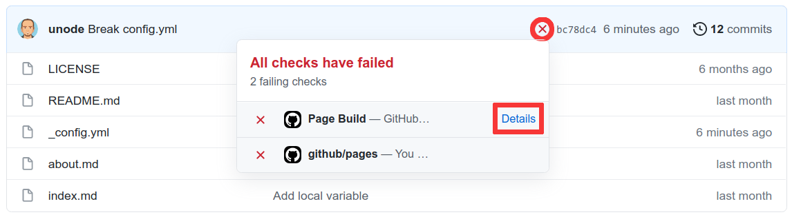
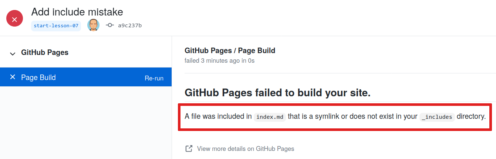

[Jekyll](https://jekyllrb.com/) is a powerful static site generator behind GitHub Pages. It creates static HTML
website content out of various files in your repository (Markdown files, CSS style sheets, page templates/layouts, etc.).
This 'compiled' content is then served as your website via the `github.io` Web domain (remember your website's URL
from the previous episode?). Jekyll automatically re-generates all the HTML pages for your website each time you
make a change to your repository.

Jekyll makes managing your website easier because it depends on templates.
Templates (or layouts in Jekyll notation) are blueprints that can be reused by multiple pages.
For example, instead of repeating the same navigation markup on every page you create
(such a header, a footer or a top navigation bar), you can create a Jekyll layout that gets used on all the pages.
Otherwise, each time you update a navigation item - you'd have to make edits on every page.
We will cover Jekyll layouts in a bit; for now let's start learning Jekyll
and its scripting language called [Liquid](https://shopify.github.io/liquid/basics/introduction/).

## Global Parameters
Jekyll's main configuration options are specified in a `_config.yml` file, which is written in a language
called [YAML](https://yaml.org/) and placed in your site’s root directory. Parameters configured in `_config.yml`
are global or site-wide - that means they are accessible in every page of your website.

> ## YAML
>
> [YAML](https://yaml.org/) is a human-readable data-serialization language. It is commonly used for configuration files and in
> applications where text data is being stored or transmitted and it is programming language agnostic.
>
{: .callout}

Let's create some configuration parameters for our website.

1. From the GitHub interface, create `_config.yml` file in your site’s root directory.
2. Add parameters `description` and `email` to it as:

   ~~~
   description: "This research project develops training materials for reseachers wanting to learn to build project
   websites in GitHub with GitHub Pages."
   email: "team@carpentries.org"
   ~~~
   {: .language-yaml}

3. Commit your changes.

Global configuration settings from
`_config.yml` are made available as `site.PARAMETER_NAME` variable in every page within the website. So, global parameter `email` we defined above would be accessed as `site.email`.

In order to access the parameter's value within a page, you use Liquid's notation to output content by surrounding a variable in curly braces as `{{ variable }}`.

> ## Predefined Global Parameters
>In addition to the global parameters you define, Jekyll also makes a number of
[useful predefined site-wide variables](https://jekyllrb.com/docs/variables#site-variables) available to you within your website: e.g. `{{ site.time }}` (the current time) or `{{ site.pages }}` (a list of all pages).
{: .callout}

Let's make use of global parameters in our pages.

1. Modify `index.md` file to make use of our global parameters like this:

   ~~~
   # Building Websites in GitHub

   ## Description
   {{ site.description }}

   More details about the project are available from the [About page](about).

   Have any questions about what we do? [We'd love to hear from you!](mailto:{{ site.email }})
   ~~~
   {: .language-markdown }

2. We can use the same parameter in different pages. Let's reuse `{{ site.description }}` and
`{{ site.email }}` in `about.md` like this:

   ~~~
   # About

   ## Project

   {{ site.description }}

   ## Funders

   We gratefully acknowledge funding from the XYZ Founding Council, under grant number 'abc'.

   ## Cite us

   You can cite the project as:

   >    *The Carpentries 2019 Annual Report. Zenodo. https://doi.org/10.5281/zenodo.3840372*

   ## Contact us

   - Email: [{{ site.email }}](mailto:{{ site.email }})
   - Twitter: [@thecarpentries](https://twitter.com/thecarpentries)
   ~~~
   {: .language-markdown }

3. Go to your website to see the changes.
4. Note that site parameters will not render nicely when viewing files in GitHub (they will be displayed as text
`{{ site.PARAMETER_NAME }}` rather than the parameter's rendered value) but will in the website.

> ## Exercise: Create a Global Twitter Parameter
> In `about.md` we have a Twitter URL under the 'Contact us' section. That's one piece of information that could go into
> global parameters in `_config.yml` as you may want to repeat it on a footer of every page.
> Make changes to your website to extract Twitter URL as a global parameter.
> > ## Solution
> > 1. Add parameter twitter to `_config.yml`:
> >
> >    ~~~
> >    description: "This research project develops training materials for reseachers wanting to learn to build project
> >    websites in GitHub with GitHub Pages."
> >    email: "team@carpentries.org"
> >    twitter: "https://twitter.com/thecarpentries"
> >    ~~~
> >    {: .language-yaml}
> >
> > 2. Make use of the twitter parameter in `about.md`:
> >
> >    ~~~
> >    # About
> >
> >    ## Project
> >
> >    {{ site.description }}
> >
> >    ## Funders
> >
> >    We gratefully acknowledge funding from the XYZ Founding Council, under grant number 'abc'.
> >
> >    ## Cite us
> >
> >    You can cite the project as:
> >
> >    > *The Carpentries 2019 Annual Report. Zenodo. https://doi.org/10.5281/zenodo.3840372*
> >
> >    ## Contact us
> >
> >    - Email: [{{ site.email }}](mailto:{{ site.email }})
> >    - Twitter: [{{ site.twitter }}]({{ site.twitter }})
> >    ~~~
> >    {: .language-markdown }
> >
> > 3. Note that you should not see any changes to your website really. However, you can now access your Twitter URL from
> > any website page, should you need to.
> {: .solution}
{: .challenge}

> ## Reuse and Reduce
> Jekyll's global parameters are a useful way to keep all your site-wide configuration in
> a single place (even if you only use them once). In combination with Jekyll layouts/templates (to be covered in the next episode) they are a great way of creating reusable markup snippets that can be repeated on multiple or even on every page of your website. Reuse helps you reduce the amount of code you have to write.
{: .callout}

## When Things Go Wrong

So far we have seen how to successfully use Jekyll to produce a website.
There are however some situations where Jekyll may fail to do so
either due to a typo or missing information.

> ## Exercise: Troubleshooting Jekyll
>
> This exercise will help you recognise what common mistakes look like
> when working with these elements of a Jekyll website.
>
> Edit your `_config.yml` file and omit a closing quote `"` in one of the variables.
>
> > ## Solution
> >
> > For instance, a missing closing quote `"` in the `twitter` variable.
> > ~~~
> > description: "This research project develops training materials for reseachers wanting to learn to build project
> > websites in GitHub with GitHub Pages."
> > email: "team@carpentries.org"
> > twitter: "https://twitter.com/thecarpentries
> > ~~~
> > {: .language-yaml}
> >
> > If you navigate your GitHub repository you would be able to see something break in `about.md` where we use `{{ site.twitter }}` however,
> > contrary to what we saw before with invalid Markdown,
> > Jekyll will refuse to build the website and produce an error message.
> >
> > We will see after this where to find the error message and identify what caused them.
> {: .solution }
{: .challenge }

If you were keeping an eye on the GitHub repository page until now, you may have noticed 
a yellow circle visible when the website is still being processed and a green check mark (✓) when successful.
You may have also noticed that in the same location there is now a red cross next to the commit message (❌).

This indicates that something went wrong with our Jekyll build process.

You may also find an email from GitHub in your inbox with details about the error.
But let's look at our repository again.
If we click the red cross next to the commit message (❌) a little pop-up will appear with additional information.

Visiting the page behind the **Details** link will give us the information we were missing.

From this page we can see that what caused the failure affected line 5 of the `_config.yml` file.
This matches the line where we deleted the `"`.
Since this typo prevents Jekyll from building the page, the process cannot continue.

> ## Failure Will Not Remove Your Website
>
> Given the failure you may be wondering what happened to the website?
> If you visit the address you will find that the website is still be available.
>
> GitHub will keep your previous version online until the error is fixed
> and a new build is completed successfully.
{: .callout }

Lets go ahead and fix your intentional typo and re-add the missing `"`:

~~~
description: "This research project develops training materials for reseachers wanting to learn to build project
websites in GitHub with GitHub Pages."
email: "team@carpentries.org"
twitter: "https://twitter.com/thecarpentries"
~~~
{: .language-yaml}

After a few seconds we should see a green checkmark again and our website will be updated.

## Local Parameters

In addition to global (site-wide) parameters available via the `site` global variable, Jekyll makes _local_ (page-specific) information available to you via the `page` variable.
Some of these are pre-defined - like `page.title`, which gives you the title of the page that is currently active/being visited. Others you can define yourself. Check this [list of predefined page parameters](https://jekyllrb.com/docs/variables#page-variables).

You can define local parameters using YAML notation within a Markdown page by including it in a page header and delimiting the header with triple-dashed lines `---`. These headers are called *front matter* and are
used to set variables and metadata on individual pages in your Jekyll site.

> ## Front matter
> From [Jekyll's website](https://jekyllrb.com/docs/front-matter/):
>
>   >   Any file that contains a YAML front matter block will be processed by Jekyll as a special file. The front matter must be the first thing in the file and must take the form of valid YAML set between triple-dashed lines.
{: .callout}

> ## Global and Local Parameters Are Case Sensitive
> It is important to note that the parameters used in the sites are case sensitive.
> By convention, usually they are all lowercase parameters.
{: .callout}

Here is an example:

~~~
---
layout: post
title: "My first blog post"
author: "Danger Mouse"
---
~~~
{: .language-yaml }

Between these triple-dashed lines, you can overwrite predefined variables (like `page.layout` or `page.title`) or create custom ones you need locally on the page (like `page.author`). These variables will then be available for you to access using Liquid's tags {{ and }} further down in the file and also in any files that include this one.  Note that these variables are only accessible on that page.  You will get an error if you try to reference a `page.variable` that was defined on a different page.

> ## Exercise: Practice With Local Variables
>
> Let's practice making and using local variables. Think of a local variable you may want to use only in your `about.md` or `index.md` page.
> If you cannot think of any, create a local variable called 'lesson-example' with the value
> of 'https://carpentries.github.io/lesson-example/' and reference it in your `index.md`.
>
> What did you add to your `index.md` to create this variable?
> Where did you add the front matter in your `index.md`?
> How did you reference that variable?
>
> > ## Solution
> >
> > Create a YAML header at the very top of `index.md` and add the `lesson-example` variable in between the
> > triple-dash delimiters. You can then reference the value within your `index.md` page as
`{{ page.lesson-example }}`. Your file should now look like:
> >
> > ~~~
> > ---
> > lesson-example: "https://carpentries.github.io/lesson-example/"
> > ---
> >
> > # Building Websites in GitHub
> >
> > ## Description
> > {{ site.description }}
> >
> > More details about the project are available from the [About page](about).
> >
> > See some [examples of our work]({{ page.lesson-example }}).
> >
> > Have any questions about what we do? [We'd love to hear from you!](mailto:{{ site.email }})
> > ~~~
> > {: .language-markdown }
> >
> > Note that this variable is not accessible from `about.md` page and is local to `index.md`.
> {: .solution}
{: .challenge}

> ## Exercise: Practice With Troubleshooting
>
> Sometimes typos happen and can make your website change in surprising ways.
> Let's experiment with some possible issues that might come up and see what happens.
>
> Try the changes listed below on your `index.md` file and see what happens when the page renders.
> You will want to correct the previous mistake each time.
> 1. Use a global or local variable that you didn't define first.
> 2. Leave the dash off the end of the YAML header.
> 3. Don't put a space between the YAML header and the rest of the page
> 4. Put the YAML header in a different location in the page.
>
> > ## Solution
> >
> > 1. The place where you used the undefined variable is blank but otherwise no error.
> >    Example:
> >
> >    ~~~
> >    Hi! {{ site.greeting }}. What have you been up to?
> >    ~~~
> >    {: .language-markdown }
> >
> > 2. The header shows somewhat in the file and the variable that was defined goes to
> >    the index page intead of the link we set.
> >
> >    ~~~
> >    ---
> >    lesson-example: "https://carpentries.github.io/lesson-example/"
> >    
> >    Examples of our work can be found at: {{ page.lesson-example }}
> >    ~~~
> >    {: .language-markdown }
> >
> > 3. This doesn't seem to affect our page but can often make more complex pages break.
> >
> >    ~~~
> >    ---
> >    lesson-example: "https://carpentries.github.io/lesson-example/"
> >    ---
> >    Examples of our work can be found at: {{ page.lesson-example }}
> >    ~~~
> >    {: .language-markdown }
> >
> > 4. This also makes the header somewhat show in the page and breaks the variable link we created.
> >
> >    ~~~
> >    Examples of our work can be found at: {{ page.lesson-example }}
> >    ---
> >    lesson-example: "https://carpentries.github.io/lesson-example/"
> >    ---
> >    ~~~
> >    {: .language-markdown }
> >
> {: .solution}
> Note: Be sure to fix any errors you intentionally introduced in your page before moving on.
{: .challenge}


