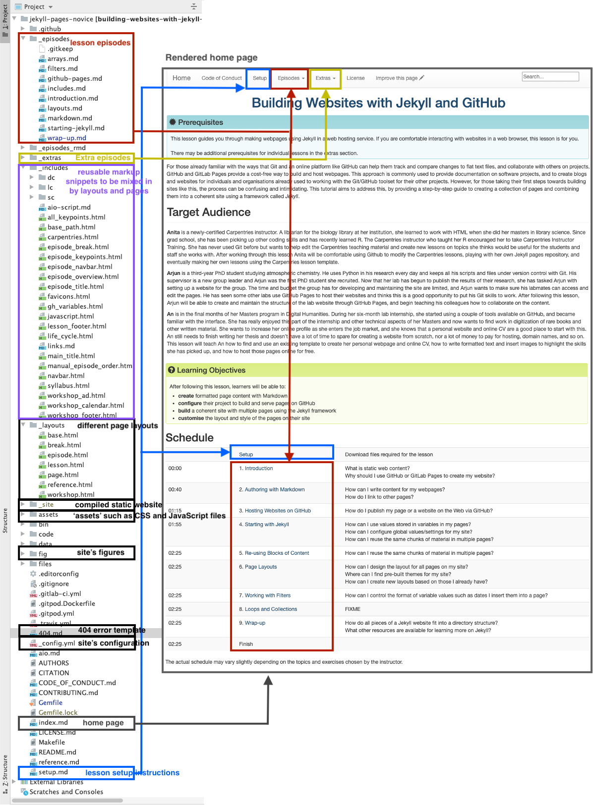
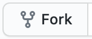
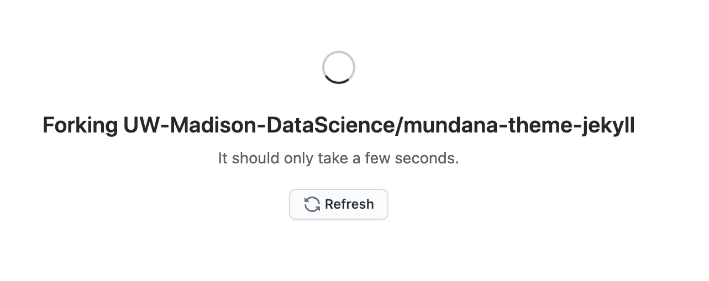
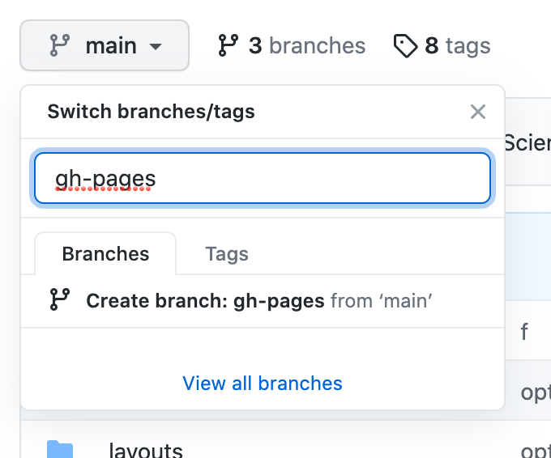



Thinking more about how you might use what you've learned in practice.
You may want to make professional-looking websites by reusing existing website themes. Here, we are going to recap what we have learned
so far and look at the anatomy of a GitHub Pages website and its common building blocks, and try using an existing theme template.

> ## Summary
>
> Throughout this lesson, we learned how to
> [create formatted webpage content with Markdown]({{ relative_root_path }}/markdown/),
> [configure a GitHub repository to use the Jekyll static site generator]({{ relative_root_path }}/github-pages/),
> and [how to use Jekyll to build our Markdown pages and various other files]({{ relative_root_path }}/starting-jekyll/)
> (HTML snippets, CSS, images, etc.) into a set of HTML documents that are then served via the GitHub Pages framework.
>
> **HTML** is the basic building block of webpages served on the Internet. It describes the structural elements of the
> page and their raw content and is often aided by **CSS** - an ordered set of styling instructions telling the browser
> how the content described in the HTML document should be organised and formatted. HTML is very verbose and difficult
> to write by hand - beyond their initial design HTML pages are meant to be processed by machines.
> For that reason, **Markdown** was introduced - a lightweight Markup language and a convention for
> adding style information to textual content while retaining the human-readable form. It is not as rich in syntax as HTML,
> but comparably more usable by a wider audience.
>
> **Jekyll** is a powerful static site generator behind **GitHub Pages** that supports a high degree of reuse and separation of
> content and presentation. It can be configured via the `_config.yml` **YAML** file
> that stores site-wide variables accessible from anywhere within our site.
> It also allows us to define and reuse page-wide variables, by defining them as the **front matter** at the beginning of
> our Markdown pages. Used in conjunction with **Liquid**, its scripting language, Jekyll allows us to include content from
> reusable markup snippets that can be repeated on multiple pages and to embed code snippets and filters into our pages to
> create some complex content assembly pipelines. That way, adding a new blog post to your website may only involve
> creating a file in the `_posts` folder of your website, setting it to use the 'post' template and focusing on its
> content - and it will magically appear at the top of your Blog timeline without any extra effort on your part.
{: .keypoints }

As a last thing, let's put it all together by having a look at a directory structure of a Jekyll website, where different
pieces are located and see how they relate to visual components on the rendered website pages.

### Jekyll Website Directory Structure

As an example, we will have a look the [Jekyll configuration used to create this lesson][jekyll-novice] (shown in the image below).
It uses [The Carpentries Jekyll theme](https://github.com/carpentries/styles), which contains
page layouts for various Carpentry websites - lesson materials, workshop websites, etc. We have created a new repository
for this lesson by copying the Carpentries theme repository and customised it by adding our episodes and other content.

Note that if you look at other Jekyll websites, they will have slightly different directory structures as
they may use different themes. However, there are some common elements, such as `index.md` (the home page),
`_config.yml` (website's global configuration),
and folders starting with `_` which have special meaning to Jekyll by convention, such as:
- `_includes` - containing reusable page snippets,
- `_layouts` - for storing theme's page templates,
- `_sass` or `assets` (without the leading `_`) where Jekyll looks for 'assets' such as CSS and
JavaScript files,
- `_data` - for storing well-formatted site data (in either the .yml, .yaml, .json, .csv or .tsv formats)
that Jekyll autoloads and makes accessible accessible via the `site.data` global variable,
- `_site` - containing the static version of the website ready to be served to users once Jekyll compiles it.

Other 'special' folders, particular to this example only, are `_episodes` and `_extras` - they are collections defined by the theme
designer and have a special role in this website/theme for storing lesson and extra episodes.
Unless these collections are configured as described in the previous episode,
they will not be automatically processed by Jekyll despite starting with the `_`. The theme designer has made sure they are embedded in the website as intended,
by defining them in `_config.yml` and referring to them in Liquid code snippets
throughout the site.
In the website example we have been building throughout this lesson,
we have seen a similar folder `_posts` where we stored content of blog posts.

Other commonly seen folders in Jekyll websites are `fig`, sometimes also named `images` or `figures`, for storing website images and figures. There is no firm naming convention in this case - Jekyll will not process
these folders automatically and the website designer will have to make sure to access/link to the content
of these folders appropriately.

{: height="1200px"}

> ## Reusing The Carpentries Jekyll Lesson Theme
> Reusing [the lesson template](https://github.com/carpentries/styles) to create a new lesson can be achieved by copying the theme repository and customising it by adding your episodes in the appropriate place.
> The template is published under [the Creative Commons Attribution 4.0 license][cc-by-human],
> which means you are free to re-use and modify it however you like as long as
> you acknowledge the original source.
> You will often find that other Jekyll themes are available with a similarly
> permissive license, but you should always check the terms to make sure you
> understand what you can and cannot do with your chosen theme.
>
{: .callout}


Have a look at another example - a simplified directory structure of a blog website ([reproduced from JekyllRb](https://jekyllrb.com/docs/structure/)).
~~~
.
├── _config.yml
├── _data
│   └── members.yml
├── _drafts
│   ├── begin-with-the-crazy-ideas.md
│   └── on-simplicity-in-technology.md
├── _includes
│   ├── footer.html
│   └── header.html
├── _layouts
│   ├── default.html
│   └── post.html
├── _posts
│   ├── 2007-10-29-why-every-programmer-should-play-nethack.md
│   └── 2009-04-26-barcamp-boston-4-roundup.md
├── _sass
│   ├── _base.scss
│   └── _layout.scss
├── _site
├── .jekyll-metadata
└── index.html # can also be an 'index.md' with valid front matter
~~~
{: .code}


## Practice Customizing a Theme

We explored building our group website piece by piece to aid in learning.
It is somewhat rare that you will be constructing the site from scratch as we did.
It is much more likely you will be reusing one of the existing templates that
others have made, many of which are freely available to use.
Let's give using a template a try using the [mundana template][mundana-site].

We have created a [copy][mundana-repo-copy] of the [original mundana repo][mundana-repo].
First open **our copy** of the [mundana template repository][mundana-repo-copy].
You will notice many directions in the `README.md` file on how to use this template.
We will be using some and leaving others for you to explore later.

To get your own copy of this repository, click the "Fork" button the upper right-hand side
of the GitHub interface.

{: height="50px"}

If you belong to many GitHub organizations, you might have to 
choose which account to copy/fork the repo to.

{: height="200px"}

Now you will have your own copy of the template to modify.
You can see the repo it was forked from in the upper left-hand side of the page.
As we did earlier in the lesson in the [Hosting Websites on GitHub episode](github-pages.md),
we need to turn on the option for GitHub to render the page as a website.
Last time we did this in the settings, this time we will create a new branch
called `gh-pages` which automatically turns on this functionality.

Click on the button on the left-hand side of the page that shows a branching icon and
says `main`.  
Then in the box that reads "Find or create a branch" type `gh-pages`.
Then click the "Create branch: gh-pages from 'main'" option that appears below.

{: height="300px"}

Once you've clicked that option you will see the box change to say `gh-pages` instead
of `main` indicating you are working on the new branch you created.
Creating a `gh-pages` branch also has turned on the website to render at
`<USERNAME>.github.io/mundana-theme-jekyll`.  You can navigate to `<USERNAME>.github.io/mundana-theme-jekyll`
and check in "Settings" to see that it worked as expected.

We will be making lots of edits to the new `gh-pages` branch in the challenges below.
This will be easier to do if we make it the default branch.
To change the `gh-pages` branch to the default branch, first click 
the branches button to the right of the drop-down menu we used to create
the `gh-pages` branch.
Then in the box that shows the `Default branch` click the two arrows button
on the upper right-hand side of the box.
Click that two arrows button again on the next page, choose `gh-pages`
from the drop down menu options, and click `Update`.
Confirm your choice by clicking `I understand, update the default branch.`.
Now when you return to the `Code` tab or the main page of your repo, you will see
`gh-pages` in the branch drop down by default.

**The following series of challenges will have you practice the skills you
learned in this lesson to modify this template.**

> ## Update GitHub About Section Link to Site
> As we did before in the [Hosting Websites on GitHub episode](github-pages.md), update
> the repository details to link directly to the rendering website
> from your fork. 
> 
{: .challenge}

> ## Customize the Configuration
> 
> Update the name and the description variables for the site.
> Reload the rendered page to see the changes to the actual site.
> 
> Hint: See the [Starting with Jekyll episode](starting-jekyll.md) for review
> 
> > ## Solution
> > 
> > The description and name variables are site-wide variables so they are found in the `_config.yml` file
> > and can be updated there.  Changes are then committed and the site can be reloaded after
> > Github re-renders the latest version of the site with Jekyll.
> > 
> {: .solution}
{: .challenge}

> ## Customize the Header Menu
> 
> Find where the header menu is created and remove the "WP", "Ghost", and 
> "Buy me a coffee" items.
>
> Hint: See the [Reusing Blocks of Content](includes.md) section for more information
> about where to find the header menu.
> 
> > ## Solution
> > 
> > Lines 12-20 need to be removed from the `_includes/menu-header.html` file.
> > 
> {: .solution}
{: .challenge}

> ## Update a Layout
> 
> 1. Update the `post` layout to remove the newsletter.
> 1. Also remove the "Share this" block to the bottom of the post where the newsletter block used to be (above "Author Box").
> 
> Hint: Review the [Page Layouts](layouts.md) episode from this lesson for more information on layouts.
>
> > ## Solution
> > 
> > 1. Lines 81-105 need to be removed to remove the newsletter.
> > 1. To move the "Share this" box, lines 45-65 should be cut (copied then deleted) and then pasted between the Article and the Author Box section.
> > 
> {: .solution}
{: .challenge}

> ## Customize the About Page
>
> Oftentimes you might want to edit some existing pages and layouts. In this exercise, we will make the
> `About` page for this site more useful by changing the layout, editing the text, and including
> it as a link in the header menu for this site.
> 
> 1. Find the `About` page and update the layout to the `page` layout,
>  turn off the comments option, remove the image and the "made with" text.
> 1. Make the `About` page content include the site description you updated
>  and any other text you'd like to add.
> 1. Update the header menu to include a link for the `About` page.
>
>
> > ## Solution
> > 
> > 1. The `About` page is called `about.md` and is in the `_pages` folder. Once found in the yaml header the variables can be changed to "page" for layout and "false" for comments.  In the body of the page the line that starts with "Made with" is removed.
> > 1. In the body of the `_pages/about.md` description variable is added using liquid syntax,  {{ site.description }} , and add any other text that might be helpful for an about page.
> > 1. The header is updated in the `_includes/menu-header.html` (this may take some searching to track down).  The same html from the other items in the header can be copied and modified.
> >
> {: .solution}
{: .challenge}

> ## Add Yourself as a Potential Author
>
> Find where the authors collection is defined and add yourself. 
> 
> Hint 1: the author for an individual post is defined in the frontmatter of the post but the
> collection of possible authors is defined in a location that allows use across the site.
>
> Hint 2: Review the [Loops and Collections](arrays.md) episode of this episode for a reminder 
> on how collections work and reminder on where you might find the authors collection.
>
> > ## Solution
> >
> > The authors collection is found in the `_config.yml`. A new entry can be made by copying
> > lines 22-28, pasting them on line 38, and then customizing them.
> >
> {: .solution}
{: .challenge}

> ## Add a New Blogpost
> Add a new blog post for today's date with the announcment of your new website.
> 
> Hint: See the [Loops and Collections](arrays.md) for reminders and more information,
> Pay close attention to the Blogging in the Wild section as it tells you more about
> how to use the built-in `_posts` functionality.
> 
> > ## Solution
> >
> > - Add a new file to the `_posts` folder with the filename `YYYY-MM-DD-some-key-info.md`.
> > - In another window, open another post in the `_posts` folder and copy the frontmatter (yaml header).
> > - Paste the front matter into your new file and change the author and title.
> > - Add some text, headers, images or other content if you wish.
> > 
> {: .solution}
{: .challenge}

> ## Use A Filter
> 
> Using this [list of Jekyll filters](https://jekyllrb.com/docs/liquid/filters/), 
> find a filter that will let you change to DD Mon YYYY for each blog post.  Edit
> the appropriate layout to change the date format.
> 
> Hint: See the [Working with Filters](filters.md) episode to review how filters work.
>
> > ## Solution
> > 
> > In the `_layouts/posts.html` file change `'%b %d, %Y'`
> > to date_to_string where the `page.date` variable is used.
> > 
> {: .solution}
{: .challenge}

> ## Detective Work: Find Comments
> Look through the site and see if you can find how it allows for comments.
> 
> > ## Solution
> > 
> > This site uses [Disqus](https://disqus.com/) to manage comments.
> > If you'd like, you can create your own account and configure the site
> > to manage your comments.
> > 
> {: .solution}
> 
{: .challenge}

## Further Resources
Below are some recommended resources to help you continue learning about Jekyll websites:

- [W3C Schools HTML tutorial](https://www.w3schools.com/html/)
- [W3C Schools CSS tutorial](https://www.w3schools.com/css/)
- [Github-flavored Markdown info page](https://docs.github.com/en/free-pro-team@latest/github/writing-on-github)
- [Getting started with GitHub Pages](https://docs.github.com/en/free-pro-team@latest/github/working-with-github-pages/getting-started-with-github-pages) from GitHub Docs
- [JekyllRB - the ultimate source of Jekyll resources](https://jekyllrb.com/)
- [Jekyll guides](https://jekyllrb.com/resources/#guides)
- [Jekyll themes](https://jekyllrb.com/resources#themes)
- [Jekyll liquid documentation](https://jekyllrb.com/docs/liquid/)


