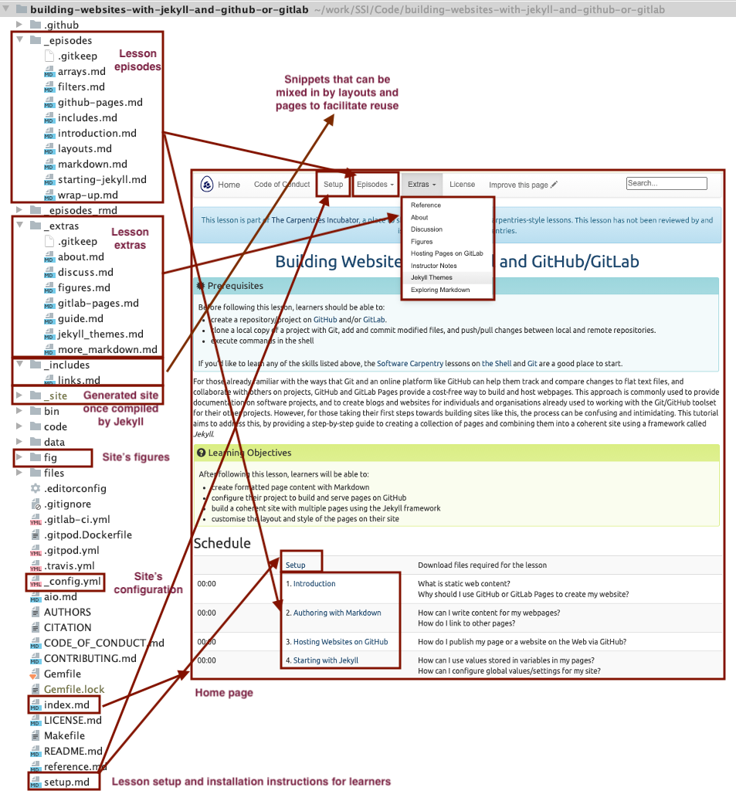

If you are a learner or an instructor that has some time left in their workshop - at this point 
we strongly recommend visiting the [Jekyll Themes episode in Extras section](../_extras/jekyll_themes.md) of the 
lesson. It builds on the knowledge we 
gained so far and expands on how to build more complex and 
professional-looking websites by reusing existing website themes. Here, we are going to recap what we have learned 
so far and look at the anatomy of a GitHub Pages website and its common building blocks, which will also help you 
better understand Jekyll themes once you get to learning about them. 

## Summary

Throughout this lesson, we learned how to create formatted webpage content with Markdown, configure a GitHub 
repository to use the Jekyll static site generator to build our Markdown pages and various other files 
(HTML snippets, CSS, images, etc.) into a set of HTML documents that are then served via the GitHub Pages framework.

HTML is the basic building block of webpages served on the Internet. It describes the structural elements of the 
page and their raw content and is often aided by CSS - an ordered set of styling instructions telling the browser 
how the content from within HTML document should be organised and formatted. It is very verbose and difficult 
to write by hand - beyond their initial design HTML pages are meant to be processed by machines. 
For that reason, Markdown was introduced - a lightweight Markup language and a convention for 
adding style information to textual content while retaining the human-readable form. It is not as rich in syntax as HTML,
but comparably more usable by a wider audience. 

Jekyll is a powerful static site generator behind GitHub Pages that supports a high degree of reuse and separation of 
content and presentation. It can be configured via the `_config.yml` YAML file 
that stores site-wide variables accessible from anywhere within our site. 
It also allows us to define and reuse page-wide variables, by defining them as the *front matter* at the beginning of
our Markdown pages. Used in conjunction with Liquid, its scripting language, Jekyll allows us to include content from 
reusable markup snippets that can be repeated on multiple pages and to embed code snippets and filters into our pages to 
create some complex content assembly pipelines. That way, adding a new blog post to your website may only involve 
creating a file in the `_posts` folder of your website, setting it to use the 'post' template and focusing on its 
content - and it will magically appear at the top of your Blog timeline without any extra effort on your part.

## Jekyll Website Directory Structure

Let's have a look at some directory structures of different Jekyll websites.

First we will visit the directory structure of the [Jekyll website used to develop this lesson](https://github.com/carpentries-incubator/building-websites-with-jekyll-and-github-or-gitlab), which uses the 
[The Carpentries Jekyll theme](https://github.com/carpentries-incubator/template), and see how it relates to visual components on the website's home page.

 

Other Jekyll websites will have slightly different structures but there are some common elements, such as `index.md`, 
`_config.yml`, and folders starting with `_` (such as `_includes` and `_site`) which have special meaning to 
Jekyll by convention. Other special folders in this case are `_episodes` and `_extras`, but these are defined by the 
theme designer and Jekyll will not automatically process these. Similar for `fig` folder holding images for the website 
(which could have been named `images` or `figures` just the same). 

> ## Reusing The Carpentries Jekyll Lesson Theme 
>Reusing [the lesson template](https://github.com/carpentries-incubator/template) to create a new lesson can be achieved by copying the theme repository and customising it by adding your episodes in the appropriate place. 
{: .callout}

Have a look at another example - a simplified directory structure of a blog website ([reproduced from JekyllRb](https://jekyllrb.com/docs/structure/)).
~~~
.
├── _config.yml
├── _data
│   └── members.yml
├── _drafts
│   ├── begin-with-the-crazy-ideas.md
│   └── on-simplicity-in-technology.md
├── _includes
│   ├── footer.html
│   └── header.html
├── _layouts
│   ├── default.html
│   └── post.html
├── _posts
│   ├── 2007-10-29-why-every-programmer-should-play-nethack.md
│   └── 2009-04-26-barcamp-boston-4-roundup.md
├── _sass
│   ├── _base.scss
│   └── _layout.scss
├── _site
├── .jekyll-metadata
└── index.html # can also be an 'index.md' with valid front matter
~~~
{: .code}

Things of note here are `_layouts` for storing theme's page templates, `_posts` for storing blog posts, 
`_sass` where Jekyll looks for 'assets' such as CSS and JavaScript files, and `_data` for storing well-formatted site 
data (in either the .yml, .yaml, .json, .csv or .tsv formats) that Jekyll will autoload and make accessible accessible 
via `site.data` global variable.

## Further Resources
- [W3C Schools HTML tutorial](https://www.w3schools.com/html/)
- [W3C Schools CSS tutorial](https://www.w3schools.com/css/)
- [Github-flavored Markdown info page](https://docs.github.com/en/free-pro-team@latest/github/writing-on-github)
- [Getting started with GitHub Pages](https://docs.github.com/en/free-pro-team@latest/github/working-with-github-pages/getting-started-with-github-pages) from GitHub Docs
- [JekyllRB - the ultimate source of Jekyll resources](https://jekyllrb.com/)
- [Jekyll Guides](https://jekyllrb.com/resources/#guides)
- [Jekyll themes](https://jekyllrb.com/resources#themes)
