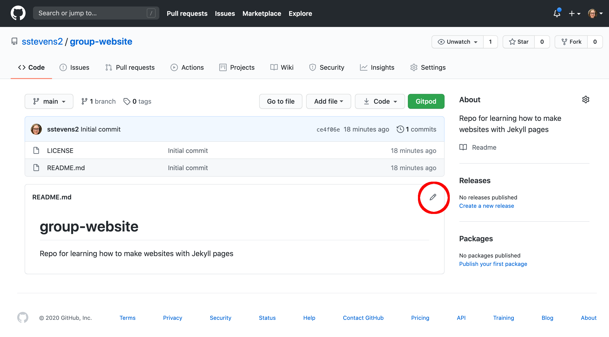
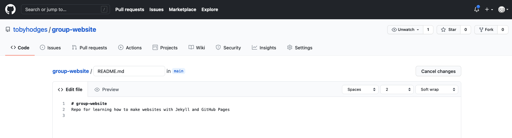
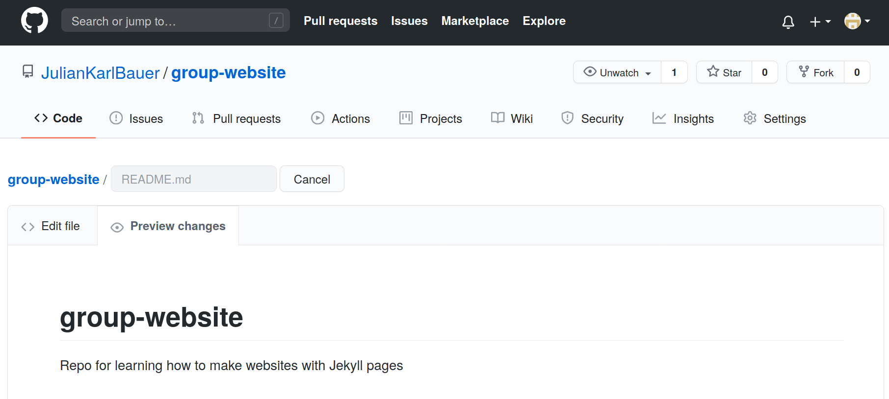
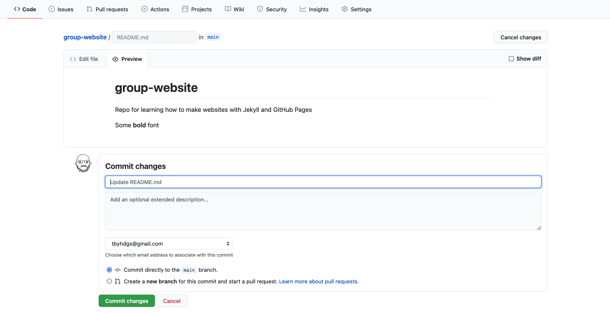
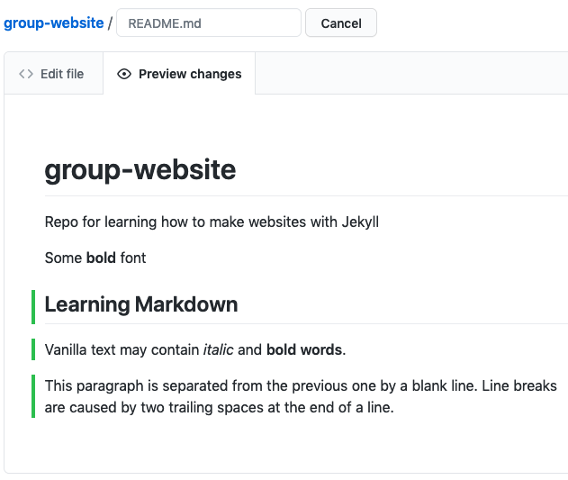
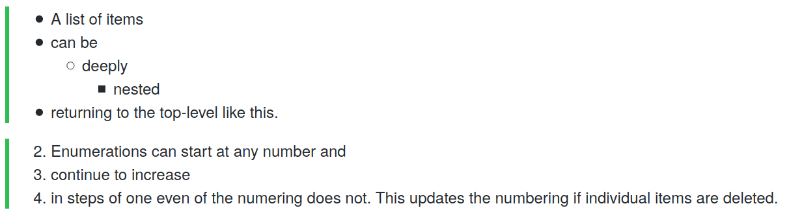
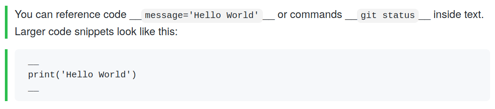
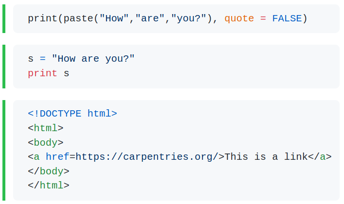
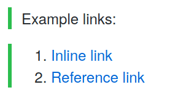

# Markdown
Markdown is a lightweight markup language, i.e. a convention for adding
style information to textual content.
As the name Markdown indicates, the syntax elements of this language
are shut *down* to a minimum.
Having a rather minimalistic syntax, text formatted in Markdown is comparably
readable.
This might be one reason for Markdown having become the language of choice
for formatted user input on websites like, for example:
- [Stack Exchange](https://stackexchange.com/)
- [GitHub](https://github.com/)
- [GitLab](https://about.gitlab.com/).


# Where to Start Writing Markdown?
A lot of tools for rendering Markdown source code exist.
Rendering is the process of generating a nice view of the content
using the style information included in the source text.
Chances are high, your editor can do this.
As we are working towards authoring websites using Jekyll and GitHub pages,
we will use GitHub straight away for learning the basics of Markdown.
The GitHub project you created in the last episode contains a file `README.md`.

The picture below shows the projects default view.
This view includes a rendered view of the content inside the file `README.md`.
Your project should look quite similar except for the red circle around the pencil symbol.




You can click on that pencil symbol to open an editing interface of your projects `README.md` file.
Once you've clicked the pencil symbol, GitHub will open that file in the editing interface.



You can change the content and have a look at the rendered view by clicking the _Preview changes_ tab.



Let's add `Some **bold** font` and see what happens when we preview it using the preview tab.
If new sections were added you will also find green vertical bars visually highlighting the new content.
To save the content to the file `README.md`, scroll down a bit and you'll see a _Commit changes_ menu
where you can commit your changes.
After having changed something, the commit menu looks like this:



> ## Writing a Commit Message
>
> A commit message is a short, descriptive, and specific comment that will help us remember later on what we did and why.
> You find more about writing commit message in [this section][swc-git-novice-episode-track-changes] of the Git-novice lesson.
>
{: .callout}


# Writing Markdown

Now that we know about the editing interface and preview tab of our projects `README.md`
we can use it as a text editor and investigate selected Markdown features.

Our `README.md` already contains vanilla text and
two formatting features:
- Heading `# group-website`
- Emphasis using `**bold**`.

Let's do some exercises to learn more about structuring and emphasis.


> ## Add a Sub Heading and Emphasised Text with Line Breaks
>
> Try to reproduce the source code of the following view.
>
> 
>
>
> > ## Solution
> >
> >     # group-website
> >     Repo for learning how to make websites with Jekyll pages
> >
> >     Some **bold** font
> >
> >     ## Learning Markdown
> >
> >     Vanilla text may contain *italic* and **bold words**.
> >
> >     This paragraph is separated from the previous one by a blank line.
> >     Line breaks  
> >     are caused by two trailing spaces at the end a line.
> >
> {: .solution }
{: .challenge }

Displaying items in lists, sometimes increases readability.
You can create lists by preceding lines with `-` or a bunch of other `-`-like characters.

> ## List today's learning goals
>
> Give it a try and write a short list of topics you want to learn today.
>
> > ## Solution
> >
> >     - Write Markdown
> >     - Host my first website on GitHub
> >     - Learn about Jekyll
> >     - Think about how my work group could benefit from what I have learned.
> >
> {: .solution }
{: .challenge }

If you would like to nest lists, i.e. specify a sub list as an item of another list, use [indentation][indentation].
Numbered enumerations are helpful for displaying sequences and the numbers may help to address individual points.

> ## Nested Lists and Enumerations
>
> Try to reproduce the source code of the following view.
>
> 
>
> > ## Solution
> >
> >     - A list of items
> >     - can be
> >       - deeply
> >         - nested
> >     - returning to the top-level like this.
> >
> >     2. Enumerations can start at any number but
> >     3. continue to increase in steps of one
> >     4. even if the numbering does not. This updates the rendered numbering to avoid gaps when individual items are deleted.
> {: .solution }
{: .challenge }

> ## Markdown Cheatsheet
>
> Markdown offers a variety of formatting features.
> Have a look at this [cheatsheet][github-flavored-markdown] to get an overview or look things up.
>
{: .callout}

You can surround text with single backticks (\') to call out code, e.g. `print('Hello world')` and
use triple backticks to format larger code snippets, creating code blocks.

> ## Add Code
> Reproduce the markdown source code to create the following view:
>
>
> 
>
> Start from the following code and fill the blanks:
>
> ~~~
> You can reference code __message='Hello World'__
> or commands __git status__ inside text.
> Larger code snippets look like this:
> __
> print('Hello World')
> __
> ~~~
> {: .source }
>
> > ## Solution
> >
> >     You can reference code `message='Hello World'`
> >     or commands `git status` inside text.
> >     Larger code snippets look like this:
> >     ```
> >     print('Hello World')
> >     ```
> >
> {: .solution }
{: .challenge }

Syntax highlighting of code blocks can increase readability a lot.
You get nice coloured code by adding an language identifier right after the
introductory triple backticks.

Let's take an example with Python:

~~~
```python
print("Hello everyone!")
```
~~~

The code above will produce the following view:

```python
print("Hello everyone!")
```

> ## Syntax Highlighting
>
> Try to reproduce the markdown source code to create the following view:
>
> 
>
>
> > ## Solution
> >
> >     ```r
> >     print(paste("How","are","you?"), quote = FALSE)
> >     ```
> >
> >     ```python
> >     s = "How are you?"
> >     print(s)
> >     ```
> >
> >     ```html
> >     <!DOCTYPE html>
> >     <html>
> >     <body>
> >     <a href=https://carpentries.org/>This is a link</a>
> >     </body>
> >     </html>
> >     ```
> {: .solution }
{: .challenge }


Linking other websites is an essential feature of a website.
Bare URLs like https://carpentries.org/ can be made clickable like this
<https://carpentries.org/> by wrapping them into
angle brackets `\< \>`.
However, usually the bare URL is not very nice and displaying a clickable
alternative text is beneficial.
To specify alternative text you can surround the text with square brackets `[ ]`.

You can then provide the URL in one of two ways:
1. Inline style links - specifying the URL in line surrounded by parenthesis `( )`- or
2. Reference style links - referencing a reusable link reference with a second set of square brackets `[ ]`.

> ## Links
> Reproduce the markdown source code to create the following view, where both links point to <https://carpentries.org/>:
>
> 
>
> Start from the following code and fill the blanks:
>
> ~~~
> Example links:
> 1. [___](https://carpentries.org/)
> 2. [___]___case-InSeNsiTiVe-reference-tag___
>
> [case-insensitive-reference-tag]: https://carpentries.org/
> ~~~
> {: .source }
>
>
> > ## Solution
> >
> >     Example links:
> >     1. [Inline link](https://carpentries.org/)
> >     2. [Reference link][case-InSeNsiTiVe-reference-tag]
> >
> >     [case-insensitive-reference-tag]: https://carpentries.org/
> >
> >
> {: .solution }
{: .challenge }

> ## Optional Exercise: Add Your Repository Details to CodiMD
>
> If your instructors are using _CodiMD_ to take notes during this workshop,
> use Markdown to add a link in that document to the repository you are using
> to follow along with this lesson.
> The link text should be your GitHub username, and the target your repository.
> Your instructors will direct you towards the appropriate location in the
> document to add your link.
>
{: .challenge }

> ## Flavors
>
> Basic Markdown features are the same on all platforms such as GitHub and GitLab.
> However, there are differences in the details and scope of the features offered.
> To address this situation, the Markdown
> used at GitHub is called **GitHub-flavored Markdown**
> and the one used at GitLab is called **GitLab Flavored Markdown**.
> - So be aware of
>   - [GitHub-flavored Markdown][github-flavored-markdown]
>   - [GitLab-flavored Markdown][gitlab-flavored-markdown]
{: .callout}



