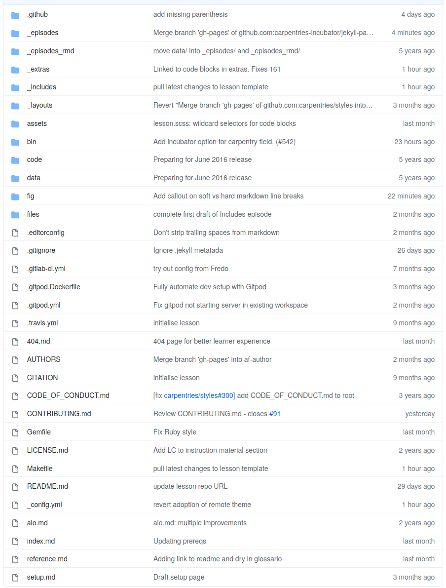

# A Jekyll lesson built with Jekyll

The lesson website we have been following is also built with Jekyll.
You can have a look at the files behind the lesson by browsing https://github.com/carpentries-incubator/building-websites-with-jekyll-and-github-or-gitlab/

## What you will find

## Jekyll

The following contain files used to build and validate the files used in the template:

* `.editorconfig` - Settings used by some editors and some scripts  in `bin/`. 
* `bin/` - A series of scripts and accessory files to maintain and validate the templates
* `code/` and `data/` - folders used to hold materials - **NOTE:** not in use in this lesson
* `Gemfile` and `Makefile` - containing machine instructions and a list of dependencies required to build the website

The following files define two other pages on the lesson website:

* `reference.md` - an aggregation of the Key Points from each episode in the lesson. This page can also contain a glossary of terms used in the website, but not in this lesson (yet).
* `setup.md` - list of requirements to get ready to follow the materials in this lesson

The following contain some of the content we have been learning through the lesson:

* `_assets`, `_episodes/`, `_extras/`, `_episodes_rmd/` and `_layouts` - collections containing files in two flavors of Markdown - [kramdown](https://kramdown.gettalong.org/) and [Rmarkdown](https://rmarkdown.rstudio.com/)
* `_includes/`
* `fig/` and `files/` - figures and files linked from templates and markdown documents
* `_config.yml` - Jekyll configuration
* `index.md`
* `README.md`
* TODO  , `_layouts`

## Non-Jekyll

The following folders are not used by Jekyll:

* `.github/` - Used by GitHub to specify [issue and pull request templates](https://docs.github.com/en/free-pro-team@latest/github/building-a-strong-community/configuring-issue-templates-for-your-repository) as well as [actions](https://docs.github.com/en/free-pro-team@latest/actions)
* `.gitignore` - Used by `git` to list [files that aren't meant to be included](https://git-scm.com/docs/gitignore)
* `.gitlab-ci.yml` and `.travis.yml` - Used by [GitLab CI](https://docs.gitlab.com/ee/ci/yaml/) and [TravisCI](https://docs.travis-ci.com/user/tutorial/) to define actions to build or validate the content of the repository.
* `.gitpod.Dockerfile` and `.gitpod.yml` - Used to configured integrations with [GitPod](https://www.gitpod.io/docs/)
* `AUTHORS` - names of all contributors to this lesson
* `CITATION`, `CODE_OF_CONDUCT.md`, `CONTRIBUTING.md` and `LICENSE.md` - how to cite, behave, contribute and what license the lesson is using. See also [FAIR citation](https://fair-software.eu/recommendations/citation), [why you should have a code of conduct and contributing guide](https://www.ethics.org/resources/free-toolkit/code-of-conduct/) and [FAIR license](https://fair-software.eu/recommendations/license).
* `aio.md` - template file for "all-in-one" version of the lesson, where the content of every episode is concatenated onto a single page 

